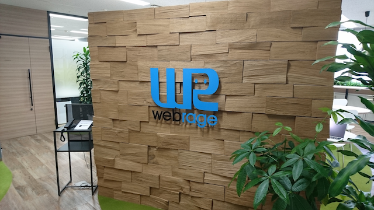

# 今期の予定

## 日程

第2期 郡山道場(2016年5月〜12月)は開催を期間で区切りいつでも参加できるような形で進めていく予定です。

* 第1期間
  - 1-1. 5/15(日) 13:00〜17:00
  - 1-2. 6/4 (土) 13:00〜17:00
  - 1-3. 6/25(土) 13:00〜17:00

* 第2期間
  - 2-1. 7/16(土) 13:00〜17:00
  - 2-2. 9/17(土) 13:00〜17:00
  - 2-3. 10/8(土) 13:00〜17:00

* 第3期間
  - 3-1. 10/29(土) 13:00〜17:00
  - 3-2. 11/19(土) 13:00〜17:00
  - 3-3. 12/10(土) 13:00〜17:00　（東北TECH道場の全会場中継の発表会）

* 全ての回に参加出来なくても大丈夫です。
* 初回と最終回に懇親会を予定しています。
* 途中からの参加も可能です。
* 日程は都合により変更する場合があります。

## 会場

ウェブレッジ福島本社 郡山ショールーム

福島県郡山市駅前2丁目11番1号 ビッグアイ18階（JR郡山駅から徒歩1分）

## 1日のタイムスケジュール

郡山道場では「講習会グループ」と「もくもく作業グループ」の2グループに分かれて進めていきます。他道場とオンライン中継して交流することもあります。

### 講習会グループ
Monacaとニフティクラウドmobile backendを使ったスマフォアプリの開発入門講座をします。

* 講義：2時間
* 演習：2時間

### もくもく作業グループ 

各自でアプリ開発をしていただきます。何か疑問点や相談がある場合は講師に相談することが出来ます。

* 各自で作業: 4時間
* 逐次質問や相談をする