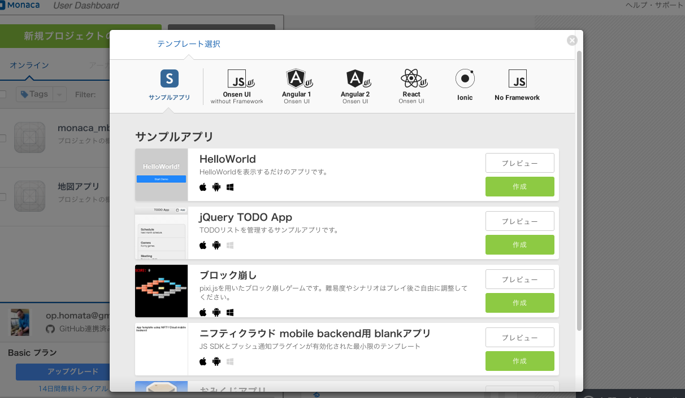
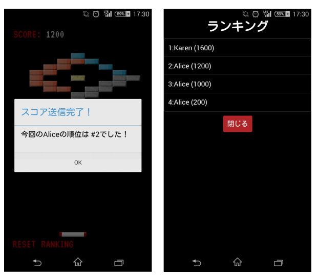
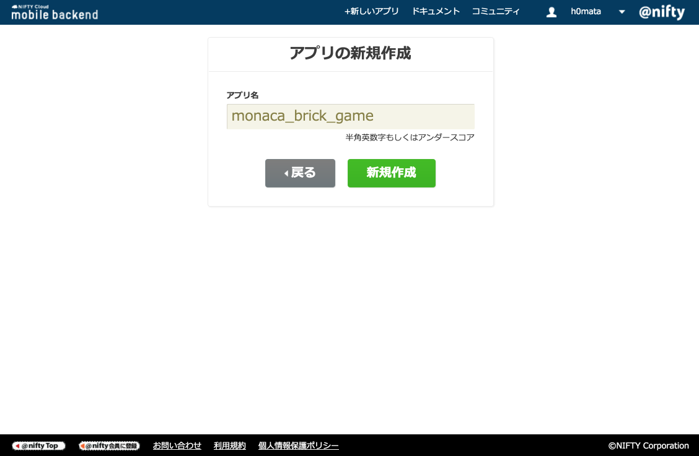
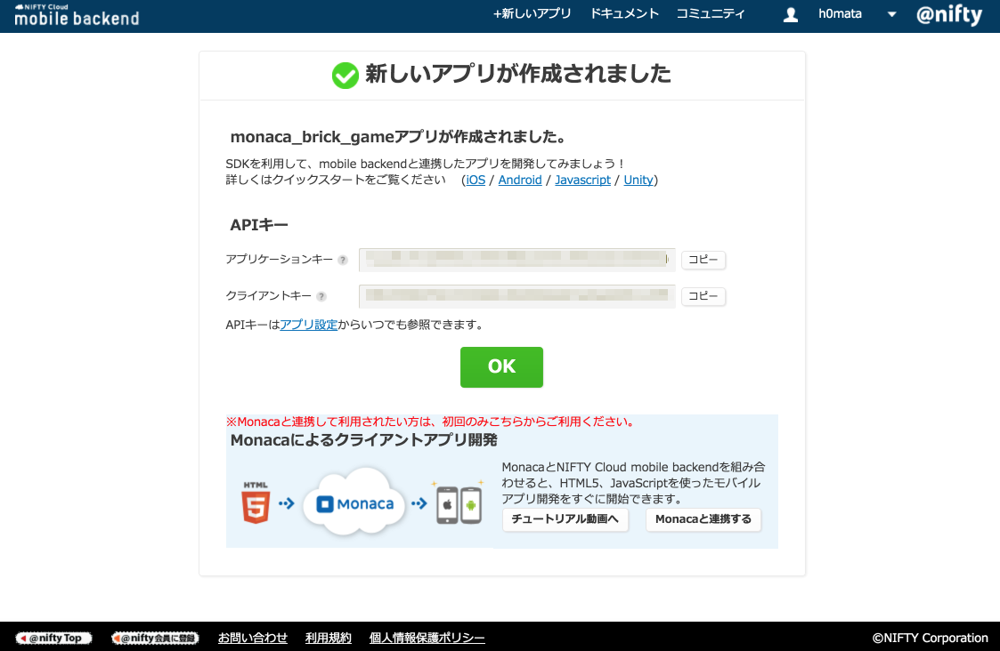
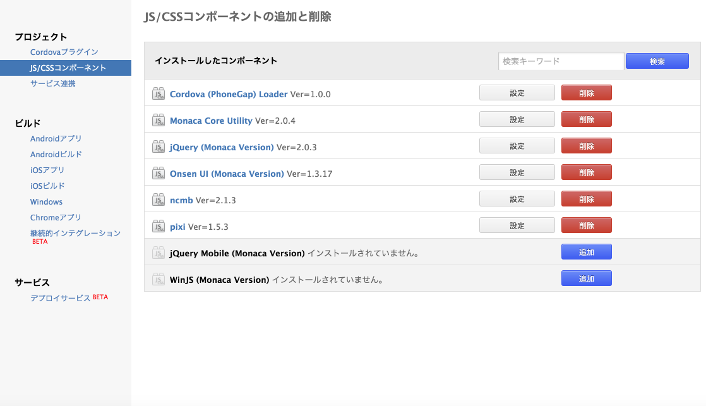
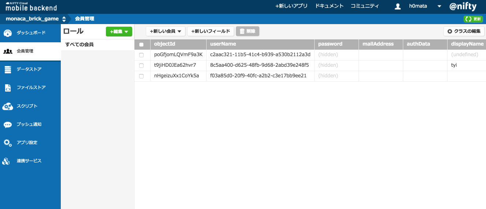

# シンプルゲーム

[ブロック崩しゲーム](https://docs.monaca.io/ja/sampleapp/samples/break_the_bricks/)
を作ります。

ブロック崩しゲームのサンプルコードはこちら
- <https://docs.monaca.io/ja/_downloads/break_the_bricks.zip>
- <https://github.com/koriyamadojo/monaca-brick-game-sample>

このアプリでは、ゲームにランキング機能をつけるのがゴールです。

こちらの資料を参考、利用しています

- [ブロック崩しゲーム](https://docs.monaca.io/ja/sampleapp/samples/break_the_bricks/)
- [Monacaアプリのゲームにランキング機能をつける](http://mb.cloud.nifty.com/doc/current/tutorial/monaca_breakout.html#スコアランキングを表示する)

---

### Pixi.js

Pixi.jsは、Goodboy Digital社が配布している2D描画用のjavascriptライブラリです。
WebGL経由でGPUを使う(（非対応のデバイスではCanvasを使う）のでHTML５のレンダリングエンジンの中でもパフォーマンスが高いと言われてます。
この**Pixi.js**を使用したゲームを作ります。

* Pixi.js
  - <http://www.pixijs.com/>
  - MITライセンス

---

## プロジェクトの作成

Monacaの「新規プロジェクトの作成」→「サンプルアプリ」→「ブロック崩し」を選択してプロジェクトを作成します。
アプリ名は任意に変更してください。



### ファイル構成

* index.html
  - スタート画面のページ
* js/main.js
  - ゲームアプリのメイン処理のJavaScript ファイル
* css/style.css
  - アプリ共通スタイルシート
* img/*.png
  - 画像ファイル
* TrueType のフォント(画面表示用)
  - res/VT323-Regular.ttf

### 必要な JS/CSS コンポーネント

* Pixi
  - JavaScriptベースのレンダリングエンジンです。

### 必要な JS/CSS コンポーネント

なし

---

### ソースコードの解説

サンプルアプリでは、既にゲームが動作するところまで出来ている。

#### js/main.js

main.js は、ゲームの処理を定義している。

BBオブジェクトが主な処理をしているメインのコードです

BBオブジェクトの主なプロパティ(変数)は下記です

- スクリーンサイズ用 ( screenSize )
- パドル用 ( paddle )
- ボール用 ( balls )
- ブロック用 ( blocks )
- スコア用 ( score )

メソッド(関数)は下記となってます。
- マップの作成用 ( setMap() )
- ボールの配置用 ( addBall() )
- パドルの配置用 ( addPaddle() )
- ゲームのリセット用 ( reset() )
- スコアの計算用 ( addScore() )
- ゲームの終了用 ( endGame() )

#### Pixiの流れ

Pixiの処理の流れは、ステージとレンダリング用のエリアを作ってオブジェクト(画像等)を配置し、時間毎にオブジェクトの位置などを変更していきます。


1. オブジェクト（画像スプライトやテキストなど）、ステージ、レンダラーを作る
2. ステージにオブジェクトを乗せる
3. レンダラーのViewをHTMLの要素に追加する
4. アニメーション処理を作る。この中で1コマで行う処理を書く。オブジェクトを動かしたり。最終的にレンダラーを使ってス5. テージを描画する処理を含める
6. アニメーション処理を繰り返し実行

```javascript
...

// ステージを作成
var stage = new PIXI.Stage(背景色を指定);

// レンダラーを作成
var renderer = PIXI.autoDetectRenderer(width, height);

// レンダラーのviewをDOMに追加する
document.getElementById("pixiview").appendChild(renderer.view);

// テキストオブジェクトを作る
var textobj = new PIXI.Text("Hello World!", {font:'bold 60pt Arial'});

// テキストオブジェクトをステージに乗せる
stage.addChild(textobj);

// アニメーション関数を定義する
function animate(){
    requestAnimFrame(animate); // 次の描画タイミングにanimateを登録する(毎回登録する)
    // フレーム毎の処理をする
    renderer.render(stage);   // 描画する
}

// 次のアニメーションフレームでanimate()を呼び出される為に登録をする
requestAnimFrame(animate);
...
```
---

## オンラインランキング機能を実装


ニフティクラウドmobilebackendを利用して、ゲームにランキング機能を実装します。



主に下記の機能を追加します

- ユーザ名入力
- ランキング表示画面
- ゲーム終了時のランキング常時

ニフティクラウドmobilebackendの機能としては、データストア（データベース）機能、会員管理・認証機能を使用します
ドキュメントは下記を参考にしてください。

* [Monacaアプリのゲームにランキング機能をつける](http://mb.cloud.nifty.com/doc/current/tutorial/monaca_breakout.html#スコアランキングを表示する)

サンプルコードは下記にあります。
* [NIFTYCloud-mbaas/monaca_mbaas_breakout](https://github.com/NIFTYCloud-mbaas/monaca_mbaas_breakout)

---

### 作成手順

作成には機能を順に実装します。

1. ゲームのスコアをサーバに保存
2. ゲームが終了時にスコアを保存
3. スコア保存時に名前を入力する
4. プレイヤー名とスコアをサーバに保存
5. スコアランキングを表示する機能

### ニフティクラウドmobilebackend用の設定

#### ニフティサーバー()側

新規にアプリを作成



アプリケーションキーとクライアントキーを取得




#### Monaca側

ncmbController.jsファイルを新規に作成して、にニフティ処理用のオブジェクトを作成します

```javascript
/ ncmbController.js

var ncmbController = {
}
```

index.htmlで、このJavaScriptファイルを読み込むように設定しておいてください。

```javascript
<script src="js/ncmbController.js"></script>
```

JS/CSSコンポーネントを追加

* JQuery ver2.0.3
* Onsen UI ver 1.3.17
* ncb ver 2.1.3



Cordovaプラグイン

* Nifty (プッシュ通知用)



---

### 処理説明

#### ncmbControllerの初期化（各種キーの読み込み）

アプリが起動したときに呼び出されるinit（main.js）にncmbControllerの初期化処理を追加します。

```javascript
// main.js -> init()

ncmbController.init(BB.screenSize);

```

初期化処理の詳細

```javascript
// ncmbController.js

var ncmbController = {
    APPLICATION_KEY: "YOUR_APPLICATION_KEY",
    CLIENT_KEY: "YOUR_CLIENT_KEY",

    ncmb: null,
    currentUser: null,  // ログインしたユーザーのオブジェクトを格納
    screenSize: null,    // 画面サイズを格納

    // 初期化
    init: function(screenSize) {
        var self = this;
        self.ncmb = new NCMB(self.APPLICATION_KEY, self.CLIENT_KEY);    // mobile backendの初期化
        self.screenSize = screenSize;
    }
}
```
YOUR_APPLICATION_KEY、YOUR_CLIENT_KEY に各自のアプリケーションキーとクライアントキーを記載します。

### スコアを保存する
スコアの保存処理を実装していきます。


### スコア保存（送信）処理を実装する

sendScore関数でスコアを保存します。
クラス生成→インスタンス生成→送信処理、という順に処理を行います。

```javascript
// ncmbController.js -> ncmbController

// スコア送信
sendScore: function(score) {
    var self = this;

    // [1]Score（クラス）を生成
    var Score = self.ncmb.DataStore("ScoreClass");

    // [2]インスタンス生成、スコア数値をフィールド名"score"にセット
    var scoreData = new Score({score: score});

    // [3]送信処理
    scoreData.save()
        .then(function (saved) {
            alert("スコア送信完了！");
        })
       .catch(function(err){
            console.log(err);
        });
},
```

ゲームクリア時とゲームオーバー時に、sendScoreを呼び出すように変更します。

```javascript
// main.js -> BB

// Game Over
endGame: function() {
    BB.gameState = GAMESTATE_STOP;
    vibrate();
    ncmbController.sendScore(BB.score);
},

// Game Clear
clearGame: function() {
    // デフォルトで表示される「ゲームクリア」ダイアログは出さない
    // if(typeof navigator.notification !== 'undefined') navigator.notification.alert("Cleared!", function(){}, "Congraturations");
    // else alert("Cleared!");

    BB.gameState = GAMESTATE_STOP;
    ncmbController.sendScore(BB.score);
}
```

### 順位を表示する
スコアの送信が完了した際、順位を表示するようにします。

データストア内のデータを検索したり取得する場合は、クエリを使用します。
検索条件をメソッドチェーンで記述し、fetchやfetchAllなどのメソッドを実行して結果を取得します。

今回、スコアの順位は「今回のスコアより大きい値の記録の数（行数）+1」で求めます。
データの件数は検索条件にcountメソッドを追加することで取得できます。

では実際に順位を取得し、アラートで表示してみましょう。
「スコア送信完了！」のアラートを削除し、以下のように記述します。

```javascript
// ncmbController.js -> ncmbController -> sendScore()

// 順位を求める
// ”score” フィールドの値が score より大きいものを取得
Score.greaterThan("score", score)
    .count()    // 件数を結果に含める
    .fetchAll()
    .then(function(scores){
        // countの結果は、取得データscoresのcountプロパティに含まれる

        // 0件のとき正しく動作するように条件分岐
        var rank = (scores.count !== undefined) ? parseInt(scores.count) + 1 : 1;

        // ダイアログの表示
        if(typeof navigator.notification !== 'undefined'){
            navigator.notification.alert(
                "今回の順位は #" + rank + " でした！",
                function(){},
                "スコア送信完了！"
                );
        } else {
            alert("スコア送信完了！\n今回の順位は #" + rank + " でした！");
        }
    })
```

### プレイヤーを登録する
順位の表示はできましたが、ランキングの1位を誰が出したのかなど、ほかのプレイヤーの情報についてはまだわかりません。そこで、プレイヤーが名前を登録できるようにします。

ゲームをプレイした後でプレイヤー名を入力してもらうため、アプリ起動時にユーザー登録（またはログイン）を裏で行い、ゲーム終了後に表示名のみを更新するという流れで実装します。

### 会員登録機能

会員管理・認証機能を使用します。
ただし、今回はユーザー（プレイヤー）の負担を少なくするため、ユーザーには表示する名前のみ入力してもらうようにし、IDとパスワードについてはランダムな文字列を設定して登録するようにします。

### ユーザー登録処理をつくる
ユーザーを登録する処理を実装します。
今回、IDとパスワードは同じランダム文字列を使用しますが、その文字列をlocalStorageに保存することで、プレイヤーがランダム文字列を意識せずにログインできるようにします。

```javascript
// ncmbController.js -> ncmbController

// ユーザー登録
createUser: function() {
    var self = this;

    //適当なUUIDを作成
    var uuid = self.uuid();

    //ユーザークラスのインスタンスを作成
    //userNameとパスワードにはuuidを設定
    var user = new self.ncmb.User({userName:uuid, password:uuid});

    //会員登録を行うメソッドを実行
    user.signUpByAccount()
        .then(function(user){
            // 登録完了後ログイン
            localStorage.setItem("userName", uuid);
            alert("ユーザー登録に成功しました！");
        })
        .catch(function(err){
            // userName が被った場合はエラーが返る
            alert("ユーザー登録に失敗しました");
        });
},
```

### 動作を確認する
init()メソッドの最後（ncmbControllerの初期化後）にcreateUserを呼び出す処理を追加し、一度動作を確認してみましょう。

```javascript
// main.js -> init()

ncmbController.createUser();
```

アプリを起動すると、自動でユーザーが作成されます。
「ユーザー登録が完了しました！」というダイアログが表示され、mobile backendのダッシュボードでも確認することができます。


### プレイヤーのログイン機能を実装する

このままではゲームを起動するたびにユーザーが作られてしまいます。
既にユーザーが作成されている場合・新しくユーザーを作成した直後の場合に、ログイン処理を行うように変更しましょう。

ユーザーIDがlocalStorageに保存されている場合や、以前ログインした際のデータが残っている場合はログインを、そうでない場合は会員登録を行うメソッドloginWithUUIDを作成します。

また、ログインした後のユーザー情報は、ncmbControllerのcurrentUserプロパティに格納します。

```javascript
// ncmbController.js -> ncmbController

// UUIDが存在すればログイン、しなければ新規作成
loginWithUUID: function() {
    var self = this;
    var userName = localStorage.getItem("userName");

    if(!userName){
        // ユーザーを作成したことがない
        self.createUser();
    } else if(!self.currentUser) {
        // ログアウト状態：userNameとパスワードでログイン
        // 今回はパスワード（第2引数）もuserNameを使用
        self.ncmb.User.login(userName, userName)
            .then(function(user){
                // ログイン後：ユーザーデータの更新
                self.currentUser = user;
                self.refreshCurrentUser();
            })
            .catch(function(err){
                // 失敗した場合：ユーザー作成
                console.log(err);
                self.createUser();
            });
    } else {
        // ログアウトしていない（前のログインデータが残っている）
        self.currentUser = self.ncmb.User.getCurrentUser();

        // userオブジェクトを使用してログイン
        self.ncmb.User.login(self.currentUser)
            .then(function(user){
                // ログイン後：ユーザーデータの更新
                self.currentUser = user;
                self.refreshCurrentUser();
            })
            .catch(function(err){
                // セッション切れの場合はログアウトして再ログイン
                console.log(err);

                self.ncmb.User.logout();  // ログアウト
                self.currentUser = null;
                self.loginWithUUID();       // 再ログイン
            });
    }
},
```

以前のユーザーデータが残ったまま一定時間が経過すると、セッション切れが発生します。セッション切れが発生した場合は、一度ログアウト処理を実行し、再度ログインする必要がありますので注意してください。

 ### currentUserプロパティの更新
ncmbControllerのcurrentUserプロパティには常に最新のuserオブジェクトを格納しておくようにするため、
ログインやプレイヤー名を変更するタイミングで必ず情報を更新するようにします。
情報を更新するためのrefreshCurrentUserメソッドを実装します。

```javascript
// ncmbController.js -> ncmbController

// currentUserプロパティを更新
refreshCurrentUser: function() {
    var self = this;
    if(!self.currentUser) return;

    // オブジェクトIDを用いてユーザーを検索（fetchById）
    self.ncmb.User.fetchById(self.currentUser.get("objectId"))
             .then(function(user){
                 self.currentUser = user;
              })
             .catch(function(err){
                console.log(err);
                self.currentUser = null;
              });
},
```

### 既存の処理の修正
loginWithUUIDは、まずログインできるかどうかを確認し、ログインできなかった場合には会員登録処理を行う流れとなっています。
そのため、会員登録処理を呼び出していた箇所でloginWithUUIDを呼び出し、ログイン処理を行うように変更します。
具体的にはinit()メソッドの最後にあったncmb.createUser()の呼び出し部分を以下のように書き換えます。

```javascript
// main.js -> init()
ncmbController.loginWithUUID();
```

また、会員登録処理が成功したらログインする必要があるので、「ユーザー登録に成功しました！」アラートの代わりに呼び出し処理を追加します。

```javascript
// ncmbController.js -> ncmbController -> createUser()

//会員登録を行うメソッドを実行
user.signUpByAccount()
    .then(function(user){
        // 登録完了後ログイン
        localStorage.setItem("userName", uuid);
        self.loginWithUUID();
    })
```

これで、ログイン処理を実装することができました。

### ユーザー名を登録する処理を実装する
ゲームプレイ後、ユーザーに名前を入力してもらう処理を実装します。会員登録はアプリ起動時に行っていますので、ここではユーザー名の更新のみ行います。

---

### OnsenUI導入
初期化のためのコードを記述します。
main.jsのinit()メソッドの最後に、以下のコードを追加してください。

```javascript
// main.js -> init()

 ons.bootstrap();

```

### 登録画面をつくる
登録するための入力フォームをHTMLに追加します。
</body>の直前に以下の内容を追記してください。

```html
<div id="mask" class="mask"></div>
<div id="userEditWrapper" class="userEditWrapper">
  <form id="userEdit">
  <label for="name">プレイヤー名</label><br />
  <input type="text" id="name" value="" class="text-input" /><br />
  <input type="button" id="submit" class="button" value="送信" />
  </form>
</div>
```

CSSについても、以下のコードを追加します（css/style.css）。
div.maskは、入力画面が表示されている間背景を暗くし、ボタン操作ができないようにするために使用します。

```css
.mask{
  display: none;
  position: absolute;
  width: 100%;
  height: 100%;
  background: rgba(0, 0, 0, .5);
  z-index: 1;
}

.userEditWrapper{
  display: none;
  position: absolute;
  width: 80%;
  padding: 10px;
  line-height: 1.5em;
  color: #fff;
  background: #000;
  border: solid 1px #b22222;
  text-align: center;
  z-index: 2;
}

.text-input{
  margin: 10px 0;
}

.button{
  background: #b22222;
}
```

### 入力欄の表示と登録処理を実装する
プレイヤー名の入力欄の表示と登録処理の実装を行います。
会員情報に新たにdisplayNameというフィールドを作成し、そこに名前を格納します。

ncmbControllerの初期化で定義したscreenSizeはここで使用します。

```javascript
// ncmbController.js -> ncmbController

// ユーザー名登録フォームの表示
showDisplayNameDialog: function() {
    var self = this;

    $("#mask").show();
    // ダイアログを左右中央に表示する
    $("#userEditWrapper").css("top", self.screenSize.height / 2 - 100);
    $("#userEditWrapper").css("left", self.screenSize.width * 0.1);
    $("#userEditWrapper").show();
},

// ユーザー名登録
updateDisplayName: function(){
    $("#userEditWrapper").hide();
    $("#mask").hide();

    // 入力した名前をカレントユーザーにセット
    var name = $("#name").val();
    this.currentUser.set("displayName", name);

    // 会員情報の更新
    return this.currentUser.update();
},
```

updateDisplayNameは、成功・失敗をPromise形式で返すようにしています。
したがって、呼び出し元ではメソッドチェーンでつなぐことができます。

### プレイヤー名の登録画面を呼び出す
スコア送信時にプレイヤー名が登録されていなければ、先ほどのメソッドを呼び出すように修正します。
合わせて、スコア送信時にログインされていない場合、ログインするように処理を変更します。

条件が複雑なので、スコア送信のメソッドとは分けて定義するようにします。
ゲーム終了後に呼び出し、条件分岐のみを行う関数finishGame(score)を追加します。

```javascript
// ncmbController.js -> ncmbController

finishGame: function(score){
    var self = this;

    if(!self.currentUser){
        self.loginWithUUID();
    } else if(!self.currentUser.displayName){
        // まだユーザー名を登録していない場合
        self.showDisplayNameDialog();

        $("#submit").on("click", function(){
            self.updateDisplayName()
                .then(function() {
                    self.sendScore(score);
                })
                .catch(function(err) {
                    console.log(err);
                    alert("ユーザー名の登録に失敗しました");
                });
        });
    } else {
        // ユーザー名登録済：スコア送信
        self.sendScore(score);
    }
},
```

合わせて、main.jsの呼び出し元も変更します。

```javascript
// main.js -> BB

// Game Over
endGame: function() {
    BB.gameState = GAMESTATE_STOP;
    vibrate();
    ncmbController.finishGame(BB.score);
},

// Game Clear
clearGame: function() {
    BB.gameState = GAMESTATE_STOP;
    ncmbController.finishGame(BB.score);
}
```

動作を確認する
ここまでで、プレイヤー名の登録処理を実装することができました。
この実装により、初回プレイ時にプレイヤー名の登録画面が表示され、2回目のプレイ以降は表示されなくなります。

### プレイヤー名登録
登録したプレイヤー名は、mobile backendのダッシュボードでも確認できます。

### プレイヤー名確認

スコアとプレイヤーを紐付ける
プレイヤーの情報は保存できましたが、このままではスコアが誰によって保存されたものなのかわかりません。
ここでは、スコアとプレイヤーの紐付け処理について実装します。

スコア保存時にプレイヤーを保存する
スコアを保存する際、userフィールドにcurrentUserを格納して保存するようにします。

```javascript
// ncmbController.js -> ncmbController -> sendScore

// [1]Score（クラス）を生成
var Score = self.ncmb.DataStore("ScoreClass");

// [2]インスタンス生成、スコア数値とログインしているユーザー（ポインタ）をセット
var scoreData = new Score({score: score, user: self.currentUser});

// [3]送信処理
scoreData.save()
    .then(function (saved) {
// 以下、既に実装したコードから変更なし
```

### 動作を確認する
ユーザースコア保存
スコアを保存してmobile backendのダッシュボードで確認すると、userフィールドにポインタが格納されていることがわかります。
クラス名とオブジェクトIDが格納されているため、ユーザーを一意に特定することができます。

### スコアランキングを表示する
ここまでで、スコアの保存と、スコアを獲得したユーザーとの紐付けを行うことが出来ました。
最後に、このデータを使ってスコアランキング機能を実装しましょう。

### ランキングを取得する
mobile backendのデータストアから、上位のスコアを取得する処理showRankingを実装します。

スコアの取得は、順位のときと同様クエリを使います。
「スコアの高い順」など、データの並び替えを行うときはorder('field', isDescended)メソッドを使用します。
上位10件を取得し、まずはコンソールに出力してみましょう。

```javascript
// ncmbController.js -> ncmbController

showRanking: function() {
    var self = this;

    //スコア情報を取得するため、クラスを作成
    var Score = self.ncmb.DataStore("ScoreClass");

    //スコアを降順に10件取得
    Score.order("score", true)
        .limit(10)
        .fetchAll()
        .then(function(results){

            // 取得した内容をコンソールに表示
            if(results.length > 0){
                for(i=0; i<results.length; i++){
                    var score = results[i],
                        rank = i + 1,
                        value = parseInt(score.score);

                    console.log(rank + ": " + value);
                }
            } else {
                console.log("スコアデータがありません");
            }

        })
        .catch(function(err){
          console.log(err);
        });
},
```

ランキング取得処理を呼び出すためのボタンを画面に設置します。
今回はRESETボタンの隣に「RANKING」というボタンを表示するようにします。
画面上の各ボタンの描画はmain.jsのBB.reset()で行っていますので、そこに追記します。

```javascript
// main.js -> BB

// Reset current game and start new one
reset: function() {
    //Reset (remove all children in the stage if exists)

    ...

    var resetLabel = new PIXI.Text("RESET", {font: "24px/1.2 vt", fill: "red"});
    resetLabel.position.x = 18;
    resetLabel.position.y = BB.renderer.height - 52;
    BB.stage.addChild(resetLabel);
    resetLabel.buttonMode = true;
    resetLabel.interactive = true;
    resetLabel.click = resetLabel.tap = function(data) {
        BB.reset();
    };
    setTimeout(function() {
        resetLabel.setText("RESET"); //for Android
    }, 1000, resetLabel);

    // ここから追加（ランキングボタン）
    var rankingLabel = new PIXI.Text("RANKING", {font: "24px/1.2 vt", fill: "red"});
    rankingLabel.position.x = 80;
    rankingLabel.position.y = BB.renderer.height - 52;
    BB.stage.addChild(rankingLabel);
    rankingLabel.buttonMode = true;
    rankingLabel.interactive = true;
    rankingLabel.click = rankingLabel.tap = function(data) {
        ncmbController.showRanking();
    };
    setTimeout(function() {
        rankingLabel.setText("RANKING"); //for Android
    }, 1000, rankingLabel);
    // ここまで追加

    ...

    BB.gameState = GAMESTATE_PLAY;
},
```

### ラベルの表示位置や文字の指定のほか、
タップしたときに先ほど作成したncmbController.showRanking()を呼び出すように設定しています。

スコアデータの中にはユーザー情報をポインタとして格納しています。
スコアデータと一緒に取得するためには、include('field')メソッドを使用します。

```javascript
// ncmbController.js -> ncmbController -> showRanking

//スコアを降順に10件取得、ユーザー情報を含める形で
Score.order("score", true)
    .include("user")
    .limit(10)
    .fetchAll()
    .then(function(results){

        // 取得した内容をコンソールに表示
        if(results.length > 0){
            for(i=0; i<results.length; i++){
                var score = results[i],
                    rank = i + 1,
                    value = parseInt(score.score),
                    displayName = "NO NAME";

                // ユーザーが正しく取得できていれば、ユーザー名を変数に格納
                if(score.user !== undefined){
                    displayName = score.user.displayName;
                }

                console.log(rank + ": " + displayName + "(" + value + ")");
            }
        } else {
            console.log("スコアデータがありません");
        }

    })
    .catch(function(err){
      console.log(err);
    });
```

### ランキング画面をつくる
取得したデータを、ランキング画面として綺麗に表示しましょう。

まずは、ランキングを表示する画面をHTMLで作ります。
</body>の直前に、以下のように追加します。

```html
<div id="ranking" class="ranking">
    <h2>ランキング</h2>
    <ul id="rankingTable" class="list list--inset rankingTable">
    </ul>
    <ons-button class="login-button" id="closeRanking">閉じる</ons-button>
</div>
```

合わせて、CSSにもスタイルを追加します。

```css
.ranking{
    display: none;
    position: absolute;
    width: 100%;
    min-height: 100%;
    color: #fff;
    background: #000;
    text-align: center;
    z-index: 3;
}

.rankingTable{
    margin: 10px 0;
}
```

先ほどランキングデータを取得していたshowRankingで、HTMLを作成するように変更します。
合わせて、ランキング画面の表示処理も実装します。

```javascript
// ncmbController.js -> ncmbController -> showRanking

//スコアを降順に10件取得、ユーザー情報を含める形で
Score.order("score", true)
    .include("user")
    .limit(10)
    .fetchAll()
    .then(function(results){

        //ランキング表のHTML生成
        var tableSource = "";
        if(results.length > 0){
            for(i=0; i<results.length; i++){
                var score = results[i],
                    rank = i + 1,
                    value = parseInt(score.score),
                    displayName = "NO NAME";

                // ユーザーが正しく取得できていれば、ユーザー名を変数に格納
                if(score.user !== undefined){
                    displayName = score.user.displayName;
                }

                tableSource += "<li class=\"list__item list__item--inset\">"
                    + rank + ":"
                    + displayName
                    + " (" + value + ")</li>";
            }
        } else {
            tableSource += "<li class=\"list__item list__item--inset\">ランキングはありません</li>";
        }

        $("#rankingTable").html(tableSource);

        //ランキング画面を表示する
        $("#ranking").show();
    })
    .catch(function(err){
      console.log(err);
    });
```

最後に、ランキング画面を閉じる処理を実装します。

```javascript
// ncmbController.js -> ncmbController

//ランキング画面を閉じる
closeRanking:function() {
    $("#ranking").hide();
}
```

ncmbControllerのinit()の中で、ボタンを押したときに動作するように設定しておきましょう。

```javascript
// ncmbController.js -> ncmbController -> init()

//閉じるボタンの動作を規定
$("body").on("click", "#closeRanking", function(){
    self.closeRanking();
});
```

### ランキング画面
Monacaデバッガーを使用する場合、[設定]→[localStorageの削除]を行うと端末からユーザー情報が削除されるため、初回起動時の状態を再現することができます。
