# 地図アプリ 

[地図アプリ](https://docs.monaca.io/ja/sampleapp/samples/sample_rss_reader/)を作ります。

地図アプリのサンプルコードはGitHubからダウンロードすることが出来ます。
- <https://github.com/koriyamadojo/monaca-map-sample>

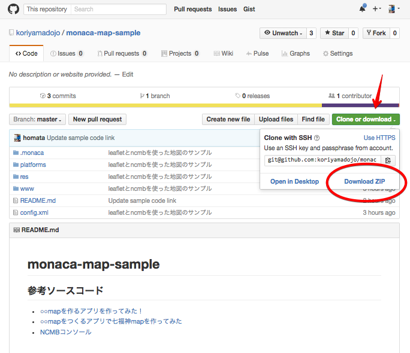

このアプリでは、サーバーサイドのニフティクラウド mobile backendサービスで利用するのがゴールです。

このアプリは下記を参考に作成しています。
- [○○mapを作るアプリを作ってみた！](http://qiita.com/fumishitan/items/2eff8fbd62e6ba31854e)
- [○○mapをつくるアプリで七福神mapを作ってみた](http://qiita.com/fumishitan/items/497db47af5be4923bdde)

---

### leaflet

地図表示は「leaflet」というJavaScriptライブラリを使います。
このアプリではOpenStreetMapを表示しますが、「leaflet」の設定を変更すれば他の地図に変更することも可能です。
注意点としてGoogleMapに変更することも可能ですがライセンスの問題でleafletプラグインを使う必要があります。

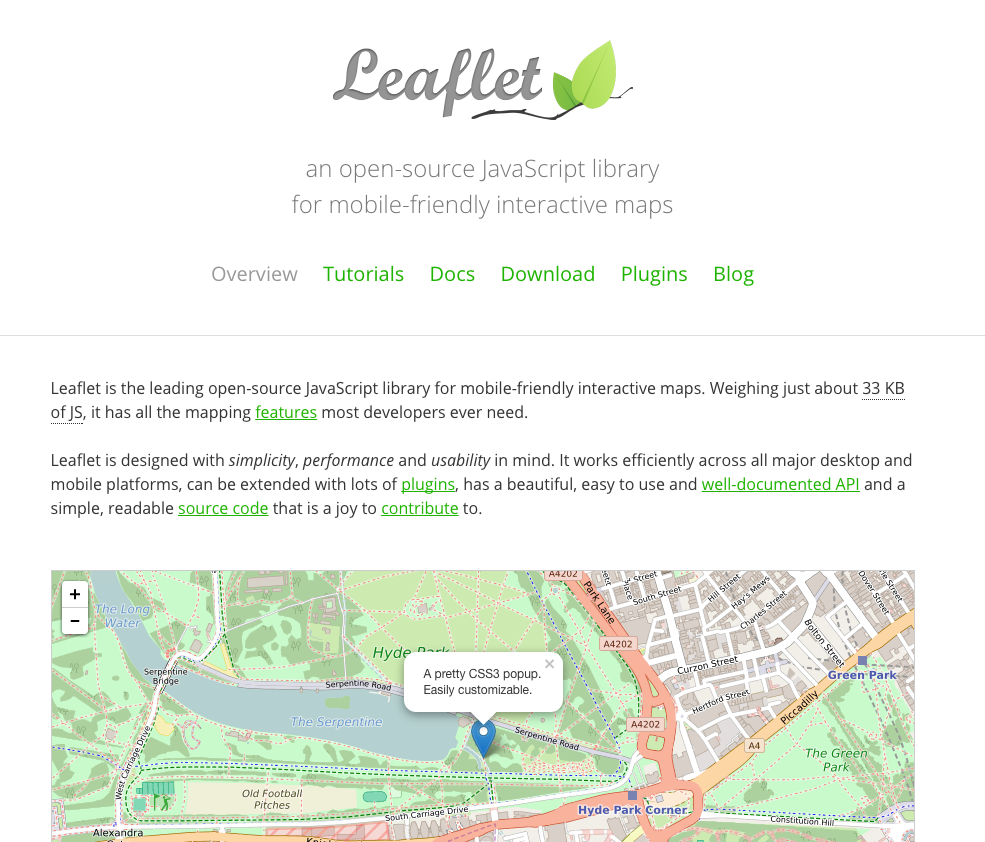

leaflet: <http://leafletjs.com/>

---

## Monacaのプロジェクトの作成

Monaca IDEで、ニフティクラウド mobile backendのプロジェクトを作成します。

「新規プロジェクト作成」→「サンプルアプリ」→「ニフティクラウド mobile backend用 blankアプリ」の順に選択をします。

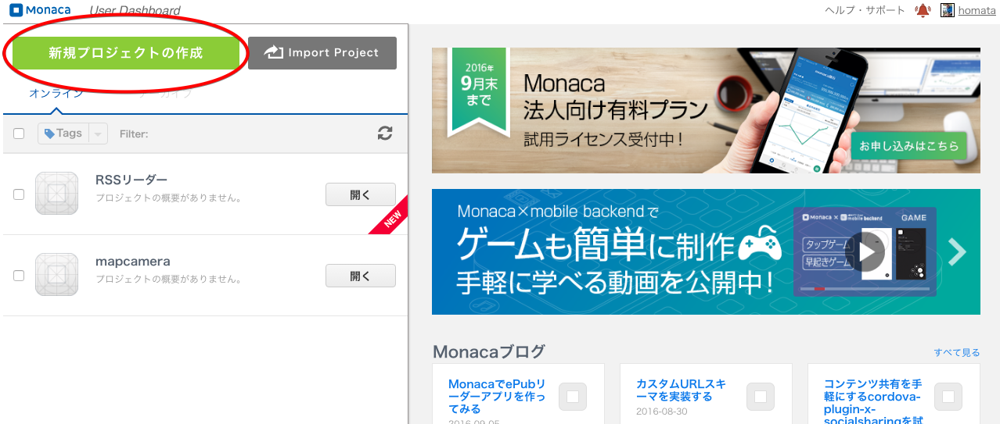
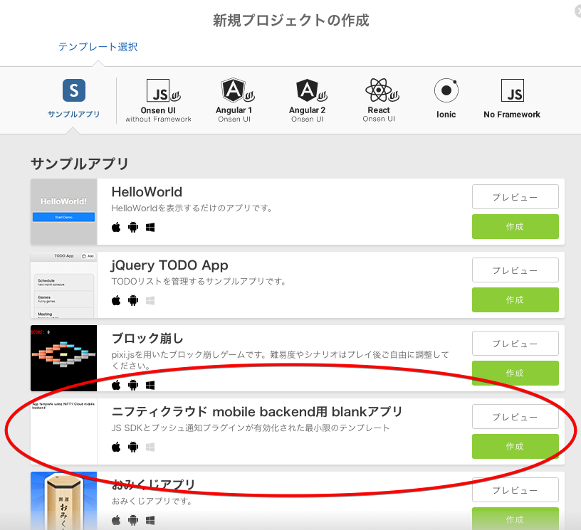

プロジェクト名は「Mapアプリ」してください。

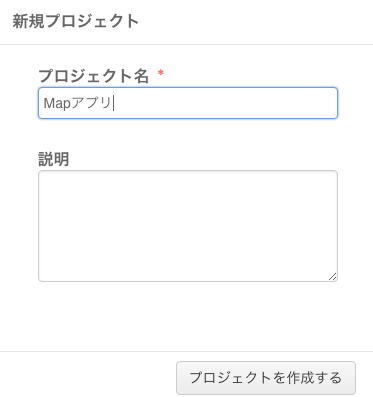

---

## ニフティクラウド mobile backendのプロジェクト作成

次にニフティクラウド mobile backendに地図アプリ用のプロジェクトを作成をします。

ニフティクラウドmobile backend <http://mb.cloud.nifty.com/>のWebサイトからニフティIDでログインをします。

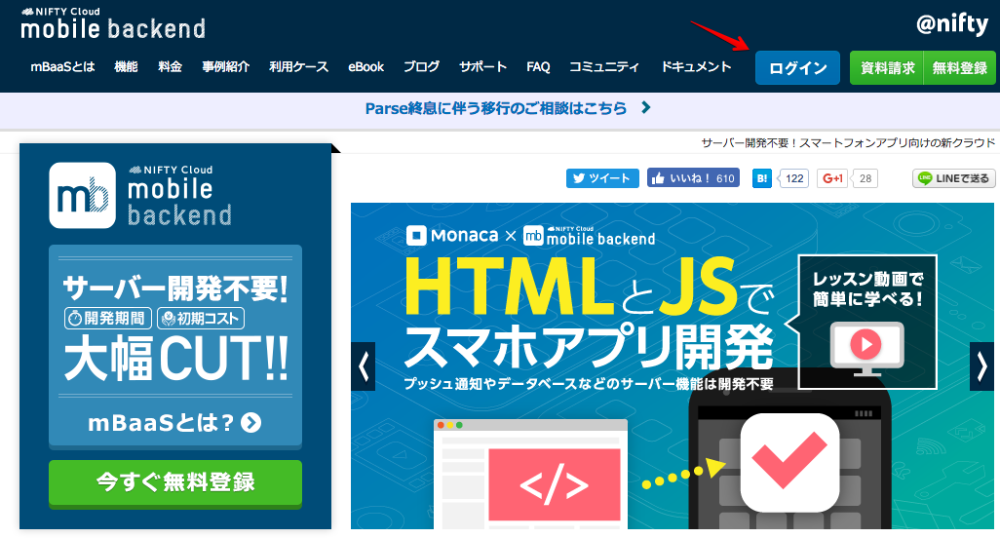

ニフティクラウド mobile backendのプロジェクトを新規作成します。
アプリ名は「map_server」としてください。
注意点として、アプリ名に使用できる文字は<font color="red">半角英数字かアンダーバー</font>だけです。日本語は使用できません。

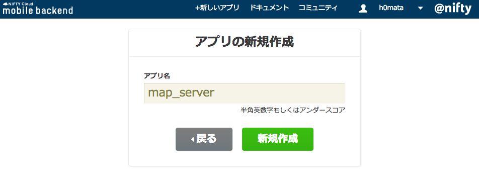

表示された「アプリケーションキー」と「クライアントキー」は、Monacaアプリからニフティクラウド mobile backendにアクセスするときに必要となりますので、2つのキーはメモしておいてください。２つのキーのメモが完了したらOKボタンを押します。

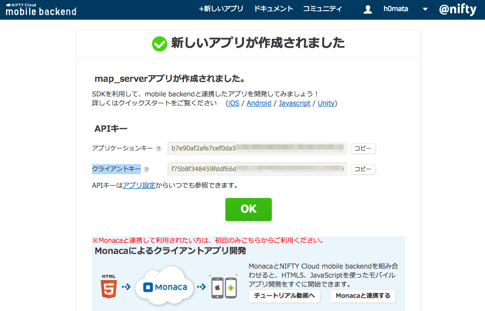

##### キーの例
- アプリケーションキー
  - b7e90af2afe7cef0da5c99cefea09fbbfa832542b07634722883519071d5xxxx
- クライアントキー
  - f75b8f348459fddf66d9182736949dfa00eb9b605c2bbe9d6c289f62e67xxxxx

## ニフティクラウド mobile backendのダッシュボード画面

プロジェクトの作成が完了すると、ニフティクラウド mobile backendのダッシュボードが表示されます。
ダッシュボードでアプリに関するサーバ側の設定や確認をすることが出来ます。

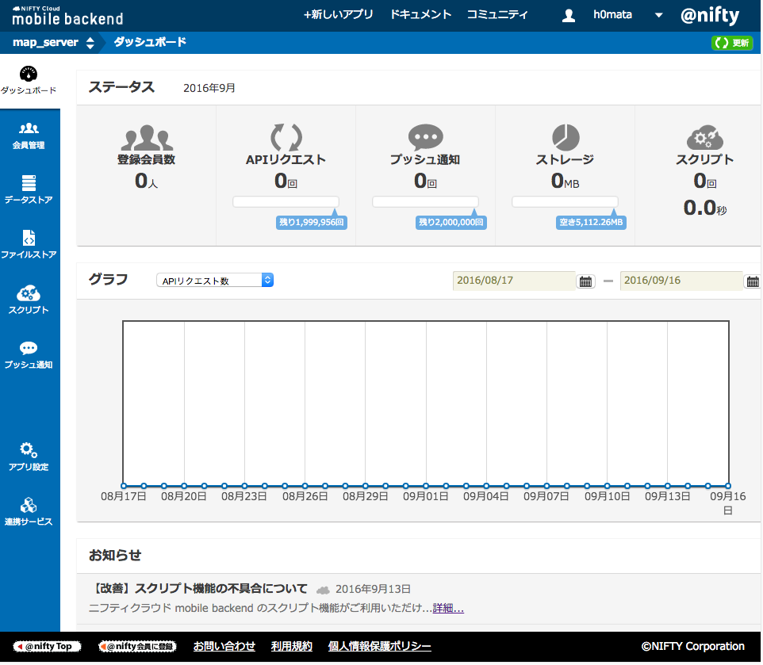

ニフティクラウド mobile backendの準備はこれだけです。

---

## Monacaで開発作業

Monaca IDEで、アプリの開発作業をして行きます。

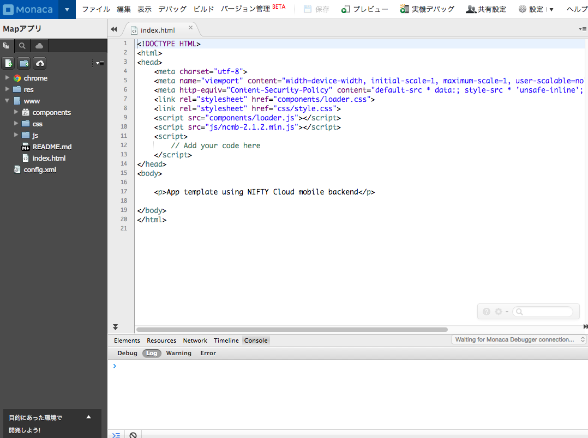

---

### ファイル構成

* index.html
  - 地図を表示するメイン画面のページ
* js/app.js
  - 地図アプリを制御するプログラムを記述していきます。

---

### 必要な JS/CSS コンポーネント

#### jQuery Mobile (Monaca Version) Ver1.3.1

JavaScriptの開発には「jQuery Mobile ライブラリ」を使用します。

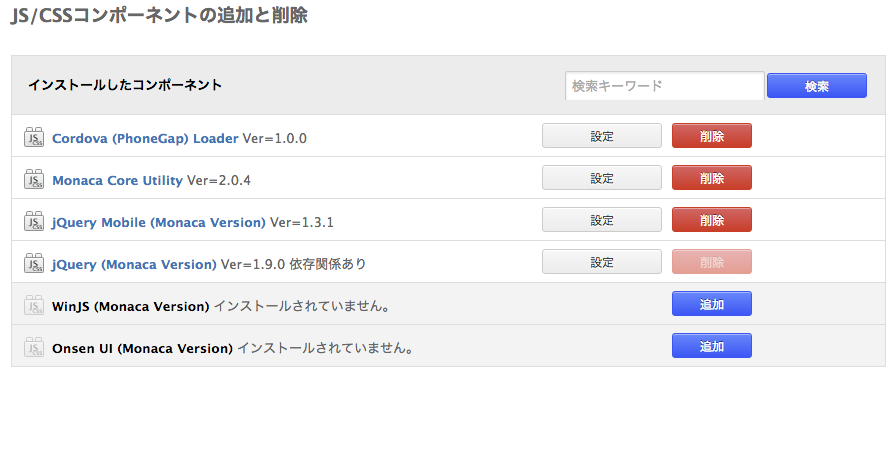

バージョンは1.3.1を選択する

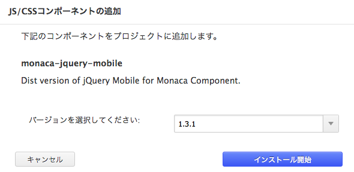

オプションは全てチェックする

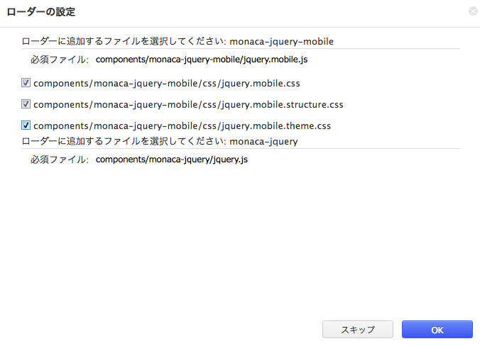

---

### 必要な Cordova プラグイン

Cordova プラグインの設定をします。

* Nifty (プロジェクト作成時に設定済)
  - ニフティクラウドmobile backendを利用する為のプラグイン
* Geolocation (新規追加)
  - 位置情報を利用する為のプラグイン

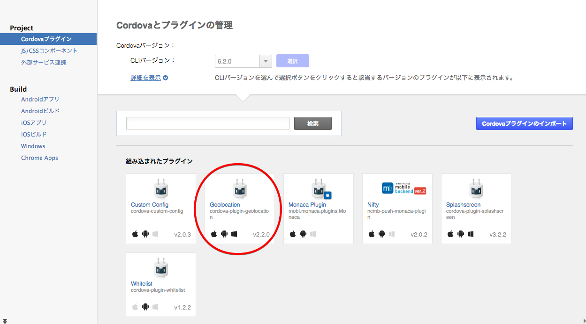

---

### app.jsの追加

地図アプリ用のapp.js(JavaScriptファイル)を作成しておいたので、これをMonacaへアップロードします。

#### アップロードの方法
app.jsファイルを下記リンクから右クリック→「リンク先を別名で保存」を選択してダウンロードしてください

* [app.jsのダウンロード](https://raw.githubusercontent.com/koriyamadojo/monaca_basic_course/master/js/422/app.js)

ファイルメニューから「アップロード」を選択するか、IDEのjsフォルダーを右クリックして「アップロード」を選択すればダウンロードすることが出来ます。

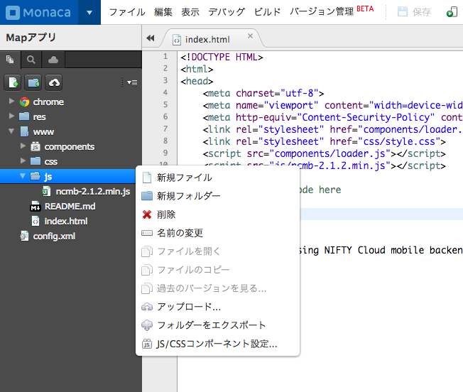

ダウンロードした「app.jsファイル」をMonacaにアップロードしてください。

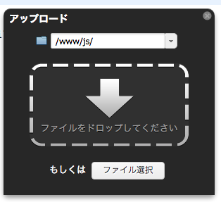

アップロードが完了すれば、下記のような画面になります。

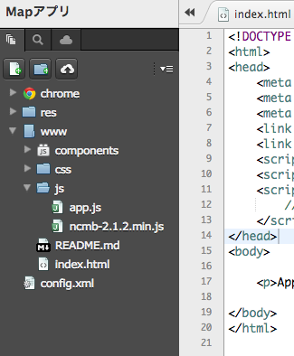

---

### HTML の解説

#### indexhtml

index.htmlを、下記のように変更します。
予め、index.htmlを用意しておいたので、ダウンロードすることも可能です。

* [index.htmlのダウンロード](https://raw.githubusercontent.com/koriyamadojo/monaca_basic_course/master/js/422/index.html)

```javascript
<!DOCTYPE HTML>
<html>
<head>
    <meta charset="utf-8">
    <meta name="viewport" content="width=device-width, initial-scale=1, maximum-scale=1, user-scalable=no">
    <meta http-equiv="Content-Security-Policy" content="default-src * data:; style-src * 'unsafe-inline'; script-src * 'unsafe-inline' 'unsafe-eval'">
    <link rel="stylesheet" href="components/loader.css">
    <link rel="stylesheet" href="css/style.css">
    <script src="components/loader.js"></script>
    <link rel="stylesheet" href="http://cdn.leafletjs.com/leaflet-0.7.3/leaflet.css" />
    <script src="http://cdn.leafletjs.com/leaflet-0.7.3/leaflet.js"></script>
    <script type="text/javascript" src="js/app.js"></script>
    <script src="js/ncmb-2.1.2.min.js"></script>
</head>
<body>
    <script type="text/javascript">
        navigator.geolocation.getCurrentPosition(onGeoSuccess, onGeoError, geoOption);
    </script>

    <button onclick="save_geopoint()">ポイントを保存する</button>
    <button onclick ="find_geopoint()" style="width:100%;">ポイントを見る</button>

    <div class="wrapper">
        <div id="canvas" style="width:100%; height:400px"</div>
    </div>
</body>
</html>
```

#### index.htmlの内容

index.htmlファイルの内容を解説します。

headerに必要な設定をします。
* leaflet.jsとleaflet.cssの追加
```javascript
...
    <link rel="stylesheet" href="http://cdn.leafletjs.com/leaflet-0.7.3/leaflet.css" />
    <script src="http://cdn.leafletjs.com/leaflet-0.7.3/leaflet.js"></script>
...
```
* app.jsの追加

```javascript
...
    <script type="text/javascript" src="js/app.js"></script>
...
```

bodyに必要な設定をします。

* スマフォン位置情報関連の設定
```javascript
...
    <script type="text/javascript">
        navigator.geolocation.getCurrentPosition(onGeoSuccess, onGeoError, geoOption);
    </script>
...
```

* ボタンの配置
```javascript
...
    <button onclick="save_geopoint()">ポイントを保存する</button>
    <button onclick ="find_geopoint()" style="width:100%;">ポイントを見る</button>
...
```
* 地図表示する場所の設定

```javascript
...
    <div class="wrapper">
        <div id="canvas" style="width:100%; height:400px"</div>
    </div>
...
```

---

### JavaScript の解説

#### アプリキーとクライアントキーの設定

ニフティクラウド mobile backendのプロジェクト作成時にメモをした。アプリキーとクライアントキーをapp.jsファイルに記述してください。
このキーが間違っていると、ニフティクラウド mobile backendにアクセス出来ないのでご注意ください。

```javascript
...
var YOUR_APP_KEY = "アプリケーションキー";
var YOUR_CLIENT_KEY = "クライアントキー";
...

```

---

#### app.jsの解説

app.jsの内容について解説して行きます。

ニフティクラウド mobile backendとの接続をアプリキーとクライアントキーを使って登録します。

```javascript
...
 //ニフティクラウドmobile backendの準備
 $(function(){
    ncmb = new NCMB(YOUR_APP_KEY,YOUR_CLIENT_KEY);
    console.debug("ニフティクラウドmobile backendの準備");
});
...

```

---

位置情報を保存するためのクラスです

```javascript
...
//現在地を保持するクラスを作成
CurrentPoint()
...
```

---

位置情報を取得するために、コールバック関数を登録します

index.html
```html
<script type="text/javascript">
    navigator.geolocation.getCurrentPosition(onGeoSuccess, onGeoError, geoOption);
</script>
```

* onGeoSuccess
  - OSMの描画時に位置情報取得に成功した場合のコールバック
* onGeoError
  - 位置情報取得に失敗した場合のコールバック
* geoOption
  - 位置情報取得時に設定するオプション
* writemap
  - OSMの描画。onGeoSuccessから呼ばれます

---

ポイントを保存するボタンの設定

index.html
```html
<button onclick="save_geopoint()">ポイントを保存する</button>
```
* save_geopoint()
  - 現在地をポイントとして登録する処理
* onSaveSuccess
  - ポイントの登録時に位置情報取得に成功した場合に呼ばれるコールバック関数

---

ポイントを表示するボタンの設定

index.html
```html
<button onclick ="find_geopoint()" style="width:100%;">ポイントを見る</button>
```

* find_geopoint
  - 登録されたポイントを引き出し地図上に表示する処理
* onFindSuccess
  - 登録ポイントの表示時に位置情報取得に成功した場合に呼ばれるコールバック関数

---

ニフティクラウドmobile backendに位置データを保存

```javascript
//ポイントの登録時に位置情報取得に成功した場合のコールバック
var onSaveSuccess = function(location){
    console.debug("onSaveSuccess");

    navigator.notification.prompt(
        ' ',  // メッセージ
        onPrompt,                  // 呼び出すコールバック
        'ポンイントの登録',     // タイトル
        ['登録','やめる'],             // ボタンのラベル名
        'ポイント名'                 // デフォルトのテキスト
    );

    function onPrompt(results) {
        current.geopoint = location.coords; 
        var geoPoint = new ncmb.GeoPoint(location.coords.latitude, location.coords.longitude);
        console.log(location.coords.latitude + ":" + location.coords.longitude);
        var Places = ncmb.DataStore("PlacePoints");
        var point = new Places();
        point.set("name",results.input1);
        point.set("geo", geoPoint);

        point.save()
            .then(function(){

            var marker = L.marker([location.coords.latitude, location.coords.longitude])
                .bindPopup("<h1>" + results.input1 + "</h1>")
                .addTo(map);
            })
            .catch(function(err){// エラー処理
            });
    }
};
```

---
ニフティクラウドmobile backendから位置データを取得する

```javascript
//登録ポイントの表示時に位置情報取得に成功した場合のコールバック
var onFindSuccess = function(location){
    console.debug("onFindSuccess");
    current.geopoint = location.coords; 
    var geoPoint = new ncmb.GeoPoint(location.coords.latitude, location.coords.longitude);
    console.log("findpoints:"+location.coords.latitude + ":" + location.coords.longitude);

    var PlacePointsClass = ncmb.DataStore("PlacePoints");
    //ニフティクラウド mobile backendにアクセスして検索開始位置を指定
    PlacePointsClass.withinKilometers("geo", geoPoint, 5)
        .fetchAll()
        .then(function(results){
        var data = [];
        for (var i = 0; i < results.length; i++) {
            var result = results[i];
            var regist_location = result.get("geo");
            var name = result.get("name");

            //マーカー＆ポップアップ追加
            var marker = L.marker([regist_location.latitude, regist_location.longitude])
                .bindPopup("<h1>" + name + "</h1>")
                .addTo(map);
        }
    });
};

```
---

### 課題

1. 使いにくいと思う部分を考えてみてください
2. 自分で欲しい機能はどんなものですか？それは実装可能でしょうか？
3. コードを読みやすくするために対応していない不具合があります。それはどこでしょう？
