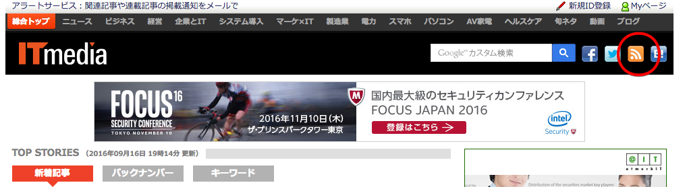
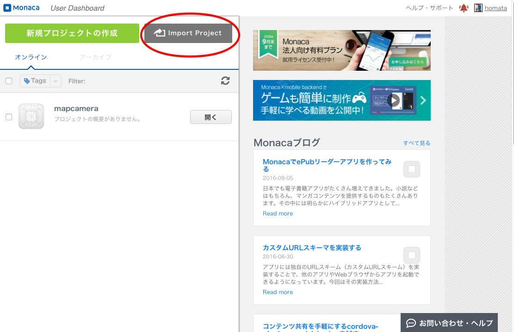
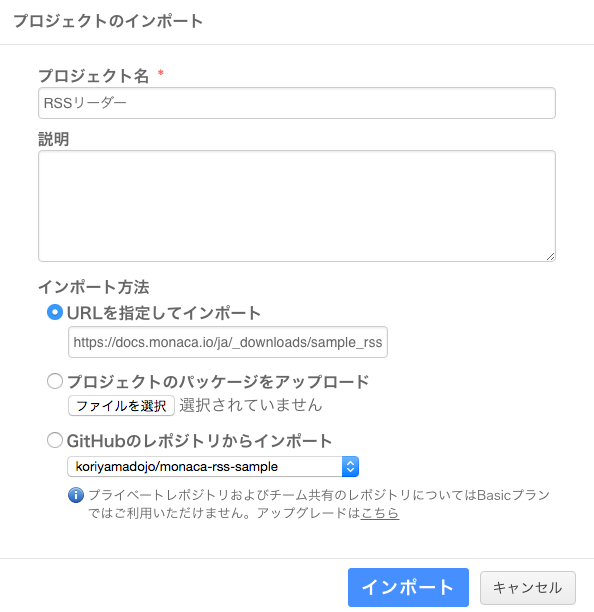
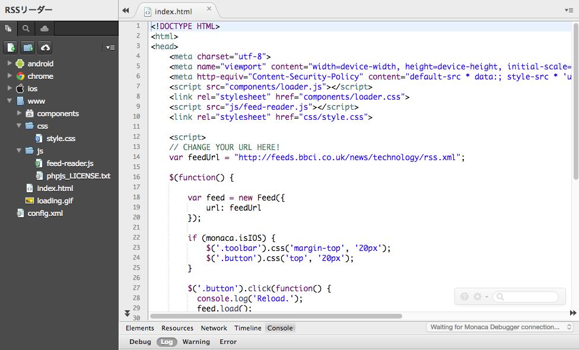
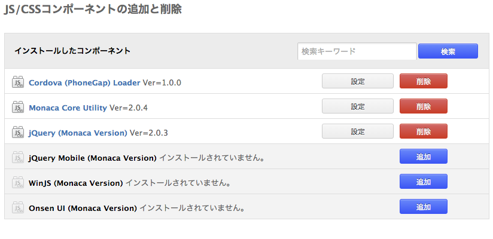
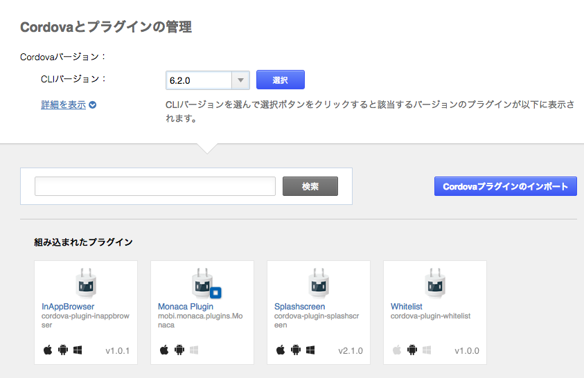
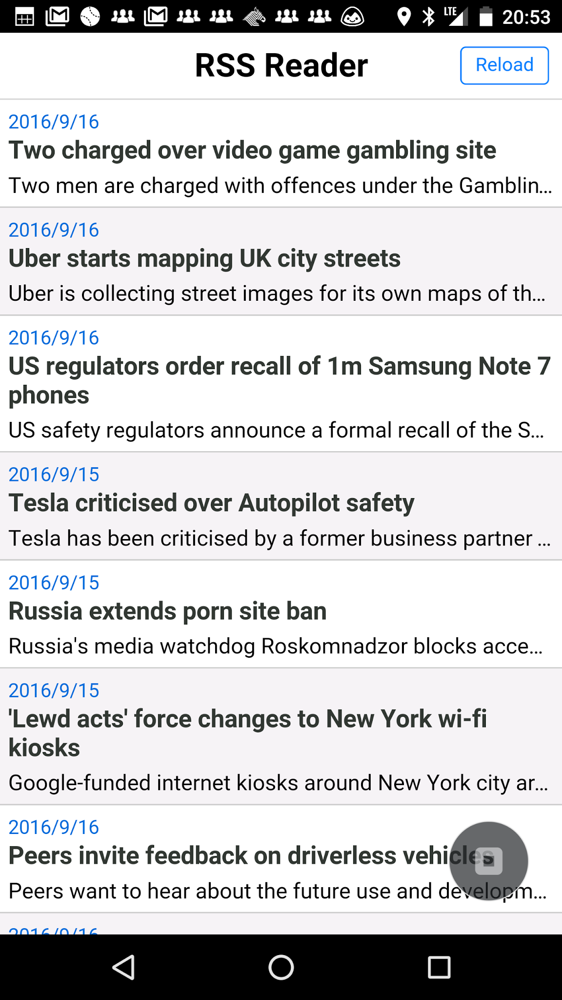
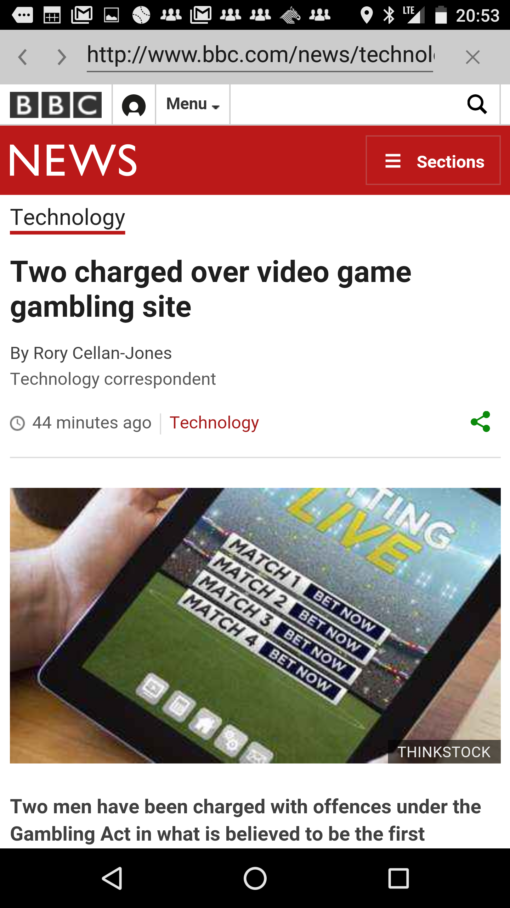

# RSSリーダー

[RSSリーダーアプリ](https://docs.monaca.io/ja/sampleapp/samples/sample_rss_reader/)を作ります。

RSSリーダーのサンプルコードはこちら
- <https://docs.monaca.io/ja/sampleapp/samples/sample_rss_reader/>
- <https://github.com/koriyamadojo/monaca-map-sample>

このアプリではAjax通信をするアプリを作るのがゴールです。

こちらの資料を参考に解説します。
<https://docs.monaca.io/ja/sampleapp/samples/sample_rss_reader/>

---

### RSSリーダーとは
RSSとは、インターネット上で配布されているニュースや情報のリンク一覧のようもので、これを読む為のアプリをRSSリーダーといいます。


参考：<http://www.itmedia.co.jp/>

---

## プロジェクトの作成

こちらから、このプロジェクトをダウンロードして利用します
<https://docs.monaca.io/ja/_downloads/sample_rss_reader.zip>


ダッシュボードを開いて「Import Porject」を開きます。



---

下記の項目を選択して最後に「インポート」ボタンをクリックします。

* プロジェクト名に「RSSリーダー」を入力する
* URLを指定してインポートを選択する
* テキストボックス「https://docs.monaca.io/ja/_downloads/sample_rss_reader.zip」を入力する



---

### ファイル構成

* index.html
  - RSS フィードを読み込むスタート画面のページ
* loading.gif
  - 「 読み込み中 」 のイメージファイル
* README.md
  - このテンプレートに関する README ファイル
* js/feed-reader.js
  - RSS フィードを取得するための JavaScript ファイル
* js/phpjs_LICENSE.txt
  - ライセンスファイル ( 任意 )
* css/style.css
  - アプリのスタイルシート



---

### 必要な JS/CSS コンポーネント
* jQuery



---

### 必要な Cordova プラグイン

* InAppBrowser
  - アプリでブラウザー機能を利用する為のプラグイン



---

### HTML の解説

#### indexhtml
index.html はスタート画面のページです。ソースコードを次に記します。

このファイルの HTML の <body> は、「 loading.gif 」、「 フィード一覧 」、「 エラーメッセージ 」 の置き場所となります。

---

### JavaScript の解説

#### index.html
アプリを起動すると、RSS フィードの取得処理が直ちに始まります。RSS フィードのコンテンツの読み込み中は、 loading.gif ファイルが表示されます。次の JavaScript コードで、RSS フィードの取得を行う関数を呼び出します。取得処理を行う関数は、feed-reader.js 内で定義されています。このファイルの解説は、後ほどします。RSS フィードで使用している URL は変更可能ですので、他の URL もぜひお試しください。

```javascript
...
//RSS Feeds URL
Feed.feedUrl = "http://feeds.bbci.co.uk/news/technology/rss.xml";

$(function() {
    Feed.watchClick();
    Feed.load();
});
...
```

#### feed-reader.js
RSS フィードを取得する関数 （ Feed.load() ） が呼ばれると、次の JavaScript コードが実行されます。

```javascript
...
    /**
     * Fetch RSS and display the contents of it
     */
    Feed.prototype.load = function() {
        var self = this;

        $(this.maskEl).show();
        $(this.errorEl).text('');

        $.ajax({
            url: this.url,
            dataType: 'text',
            crossDomain: true,
            success: function(data) {
                data = $.parseXML(data.trim());

                $(self.listEl).empty();

                // Display RSS contents
                var $rss = $(data);
                $rss.find('item').each(function() {
                    var item = this;
                    $(self.listEl).append(self.createListElement(item));
                });
            },
            error: function() {
                $(self.errorEl).text('Failed to load RSS.');
            },
            complete: function() {
                $(self.maskEl).hide();
            }
        });
...
```
この関数の実行に成功すると、取得した RSS フィードが、スタート/ホーム画面のページ上に、一覧状に表示されます。下のスクリーンショットをご確認ください。



---

次の JavaScript で、スタート/ホーム画面 ( index.html ) の RSS フィードの配置と表示を行います。

```javascript
...
    /**
     * Create list element
     * @param Array item
     * @returns DOMElement
     */
    Feed.prototype.createListElement = function(item) {
        var $item = $(item);
        
        var link = this.escape($item.find('link').text());
        var title = this.escape($item.find('title').text());
        var description = this.escape(strip_tags($item.find('description').text()));
        var date = new Date($item.find('pubDate').text());

        return '<li class="feed-item" data-link="' + link + '">' +
            '<time>' + date.getFullYear() + '/' + (date.getMonth() + 1) + '/' + date.getDate() + '</time>' +
            '<h2>' + title + '</h2><p>' + description + '</p></li>';
    };...
```
RSSフィードは、一覧形式で表示されています。このフィードの各リンクをクリックすると、次のサンプルのように、ChildBrowser 内で指定先の URL へ遷移します。



次の JavaScript コードで上述の動作をします。
```javascript
...
    Feed.prototype.addClickHandler = function() {
        $(this.listEl).on('click', 'li', function() {
            var url = $(this).data('link');

            if (/^http/.test(url)) {
                var ref = window.open(url, '_blank', 'location=yes');
                ref.addEventListener("exit", function() {});
            } else {
                alert('Invalid URL.');
            }
        });
    };
...
```
---

### 課題

1. 表示するRSS情報のURLを日本語のサイトに変更してみてください
2. 画面パーツの色や配置を変更してみてください。
