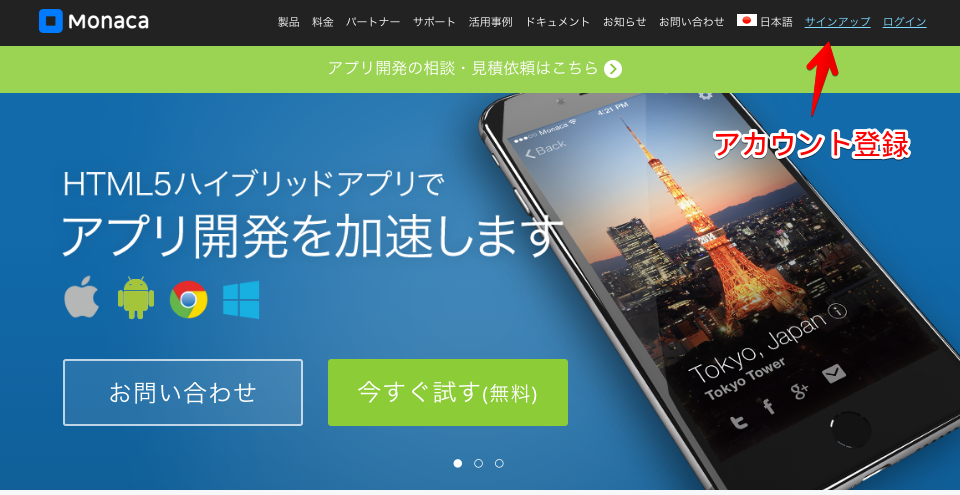
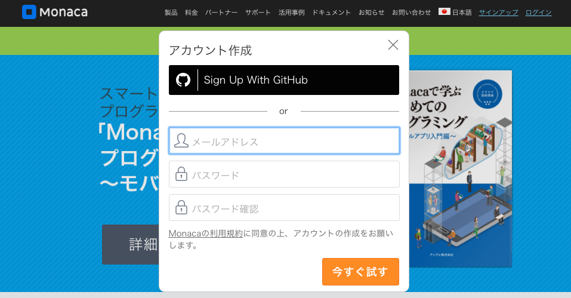
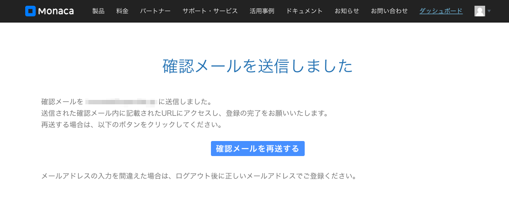
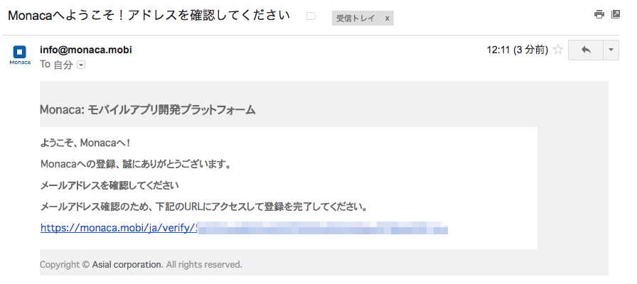

事前準備
------------

MonacaとNIFTY Cloud mobile backendを使ってアプリを作成する為にはアカウント登録をする必要があります。
どちらも無料利用枠の範囲内であれば無料で利用することが出来ますので登録をお願いします。
登録にはメールアドレスが必要になりますので、登録するメールアドレスを用意してください。
メールアドレスは作成したAndroidアプリをGoogle Play等にアプリを登録する場合にも必要となります。
もしメールアドレスを持ってない方は、Gmail (<https://mail.google.com/>)のメールアドレスを取得することをオススメします。

## Monacaのユーザ登録方法

1. Monacaのホームページ (<https://ja.monaca.io>) に行く

2. Monacaのアカウント登録画面

Monacaの利用規約の同意の元に、メールアドレスとパスワードを入力します。
パスワード同じものを２回入力してください。
入力後「今すぐ試す」ボタンを押します

※ GitHubアカウントを持っている方は、GitHubアカウントでも登録することが出来ます。

3. 確認メール送信

登録したメールアドレスに確認メールが送信されます。

4. 登録完了

受信したメールに添付されているリンクアドレスをクリックして、登録を完了してください。

## ニフティクラウド mobile backend

- URL <http://mb.cloud.nifty.com/>
- 利用登録
