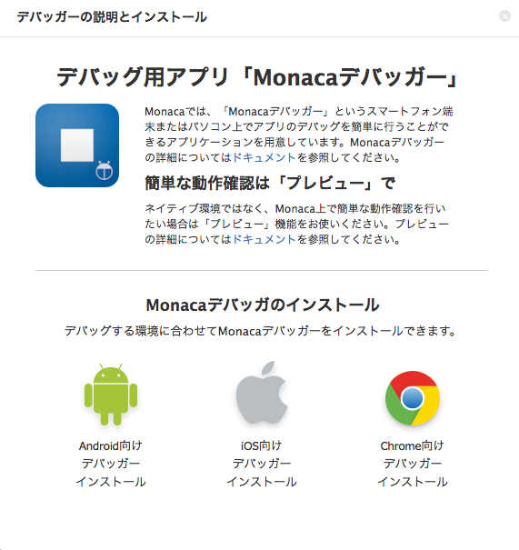
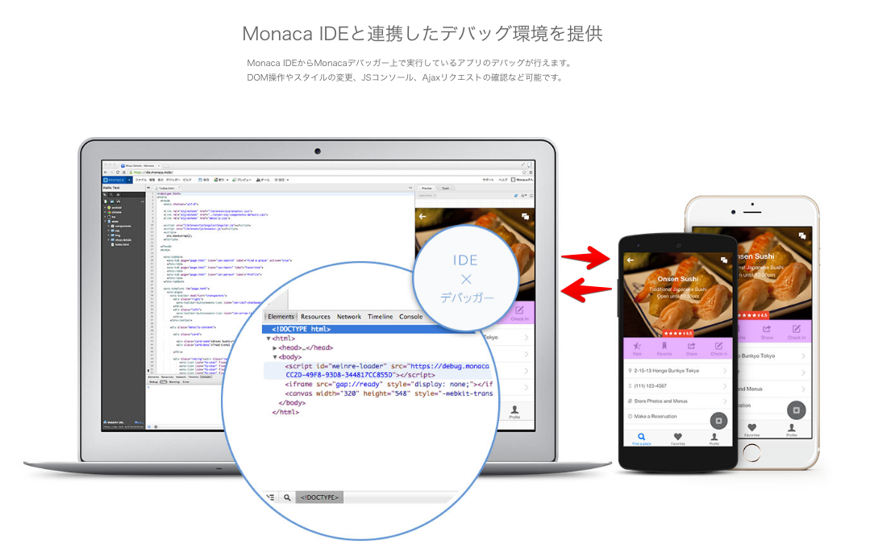
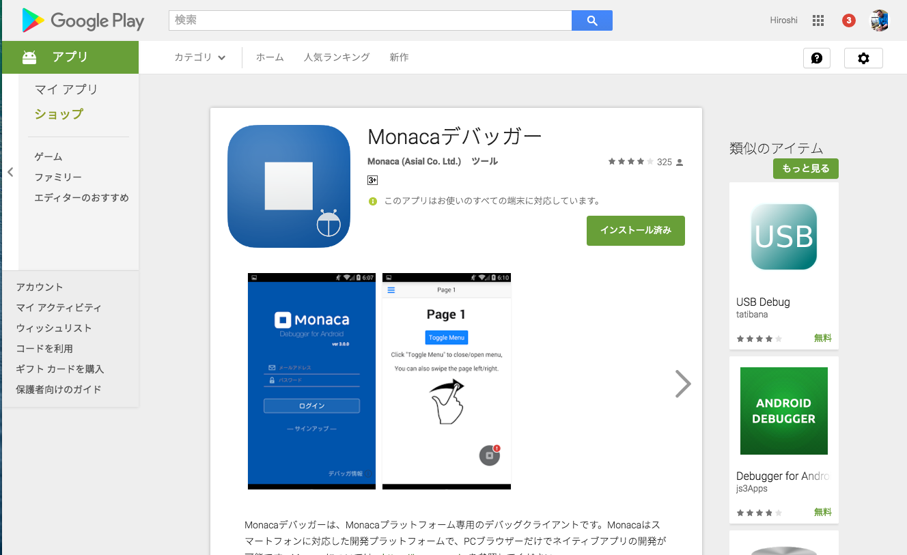
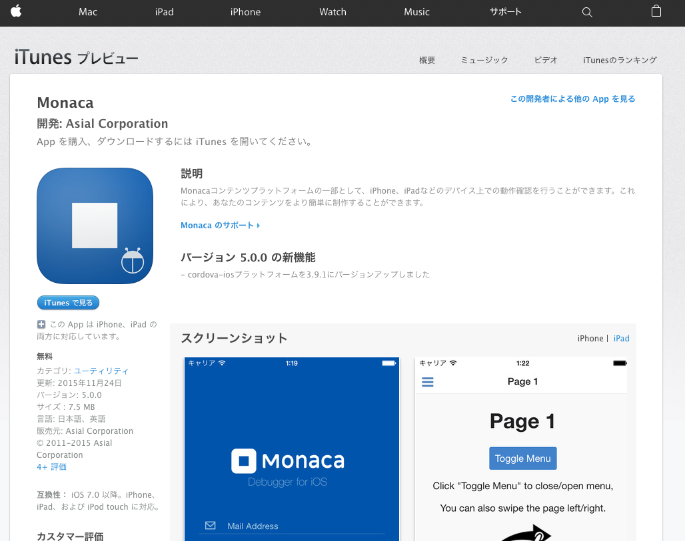
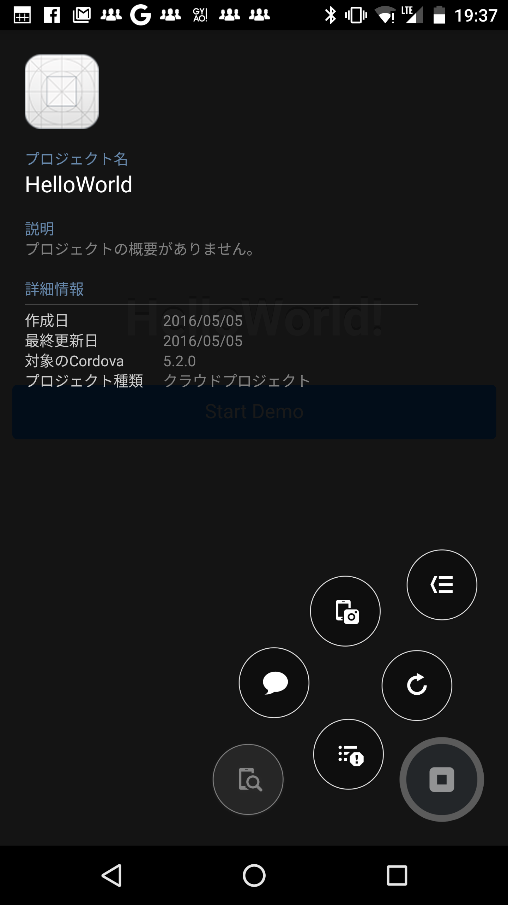
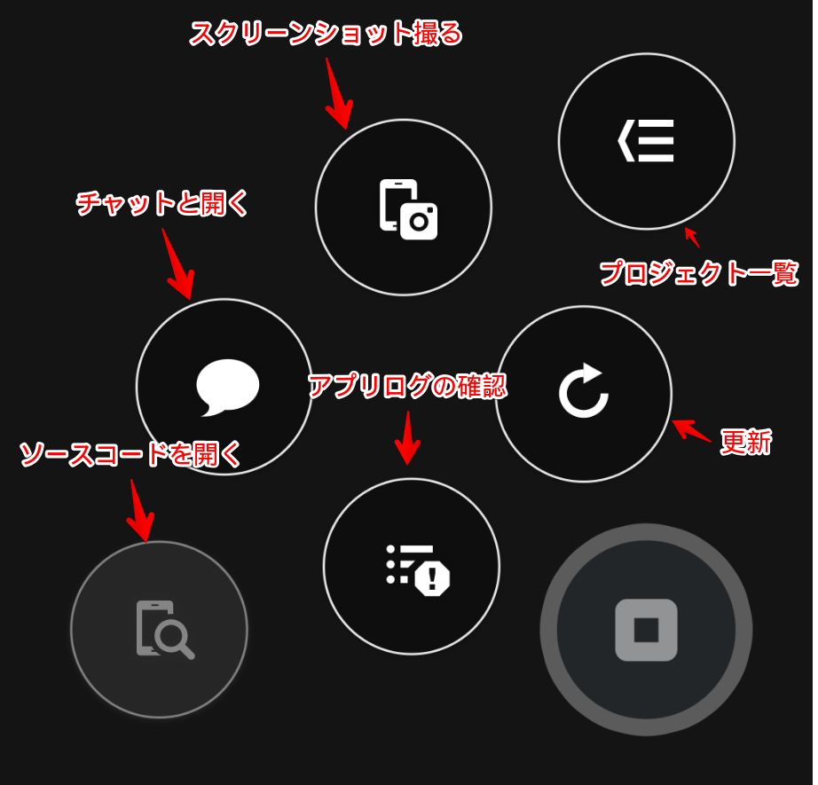

Monacaデバッカー
------------

Monacaデバッガーは、iPhoneやAndroid端末上で動作するアプリです。

MonacaクラウドIDE等とMonacaクラウドを経由して通信をすることで実際の端末を使った検証(動作確認をすることが)出来ます

### Monacaデバッカーアプリ

#### 対応環境
* iOS 8以上
* Android 4.0以上
* Wi-Fi接続を推奨します

#### Androidアプリ

* [Google Play](https://play.google.com/store/apps/details?id=mobi.monaca.debugger)

#### iOSアプリ
* [App Store](https://itunes.apple.com/jp/app/monaca/id550941371)

### アプリ画面例

Androidアプリの画面例

### Androidアプリの操作パネル

## 参考

* [Monaca デバッガー](https://docs.monaca.io/ja/manual/debugger/)
