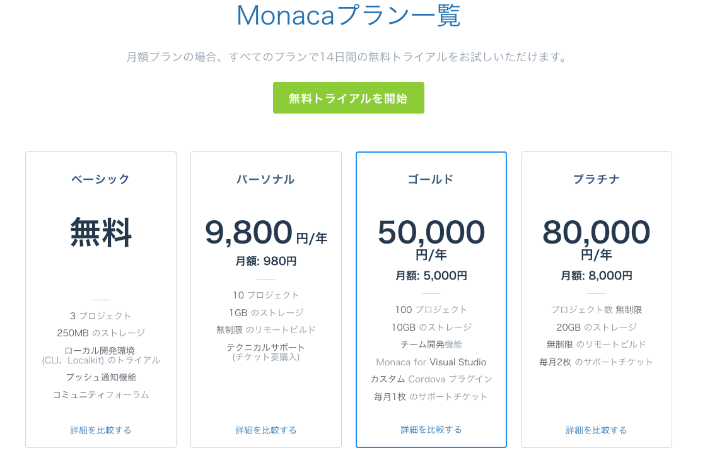
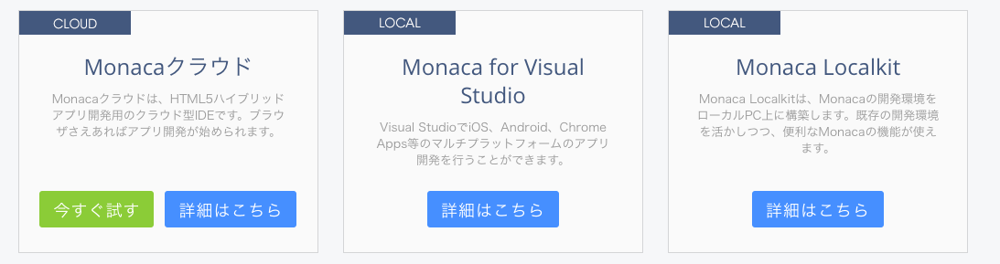

開発環境
------------

## Monacaの料金プラン

Monacaはクラウドサービスとして幾つかの料金プランがあります。
有料プランを購入することで、より便利な開発環境を利用することが出来ます

## 開発ツール

Monacaでは様々な開発環境が提供されていますが、本資料では無料枠で利用出来る「MonacaクラウドIDE」についてのみ説明をします。

1. MonacaクラウドIDE
   - Monacaクラウドと連携してWebブラウザー上で開発する為のツールです。
2. Monaca Localkit
   - Monacaクラウドと連携してパソコン上で開発する為のツールです。
3. Monaca for Visual Studio
   - Monacaクラウドと連携してWindowsパソコン上のMicrosoft Visual Studioで開発する為のアドンツールです。

**その他**

* Monaca CLI
  - Monacaクラウドを操作する為のコマンドライン形式のツール

