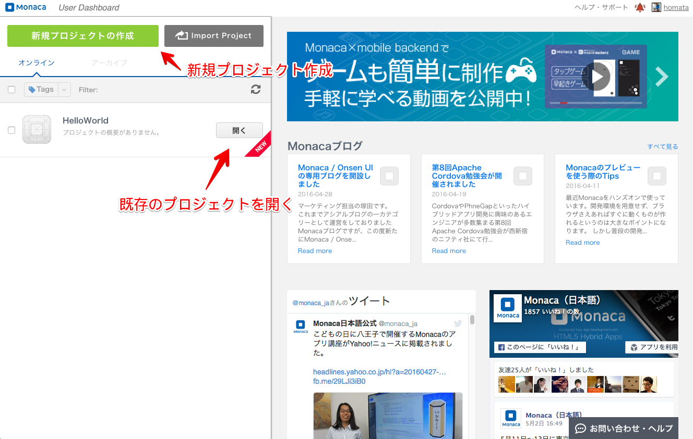
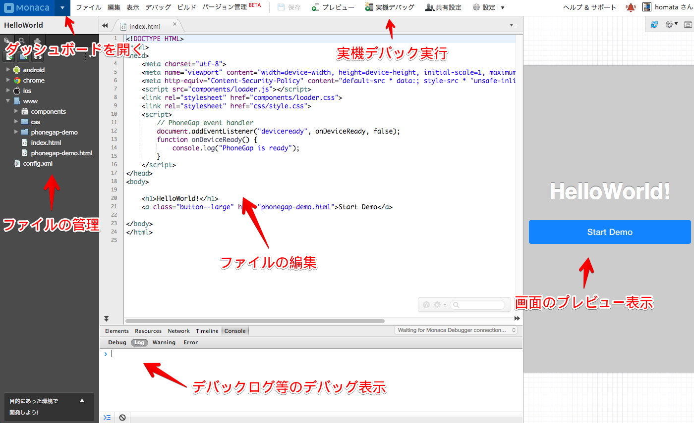

Monaca クラウド IDE
------------

MonacaクラウドIDEは、Monacaクラウドと連携してWebブラウザー上で開発する為のツールです。

## ダッシュボード

Monacaのダッシュボード(<https://monaca.mobi/ja/dashboard>)から開発するプロジェクトを起動させます。

* ** 新規プロジェクトの作成 **
  - 新規にプロジェクトを作成する場合に選択をします
* ** プロジェクトを開く **
  - 既存のプロジェクトを開く場合に選択します。

## メイン画面

Monaca クラウド IDEのメイン画面です。この画面上でコーディングやデバッグなどの開発作業をします。

## 開発に必要なもの

* Monacaアカウント
* ブラウザーの動作する、パソコンまたはコンピュータ
* インターネット接続環境 (安定したインターネット環境が望ましい)
* iPhonedまたはAndroid端末。端末上で検証する時に必要となります。

## 動作環境

### MonacaクラウドIDE対応環境
* ブラウザー: 最新版のChrome

### ビルドアプリ
* iOS 8以上
* Android 4.0以上
* Windows 8.1

## 参考

* [Monaca クラウド IDE チュートリアル](https://docs.monaca.io/ja/quick_start/cloud_ide/)
