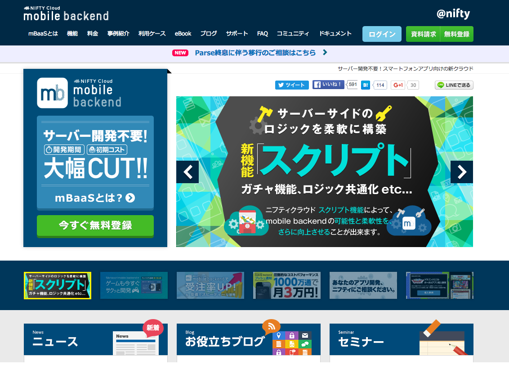
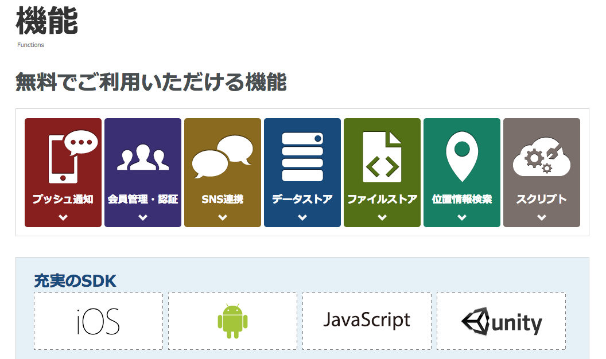
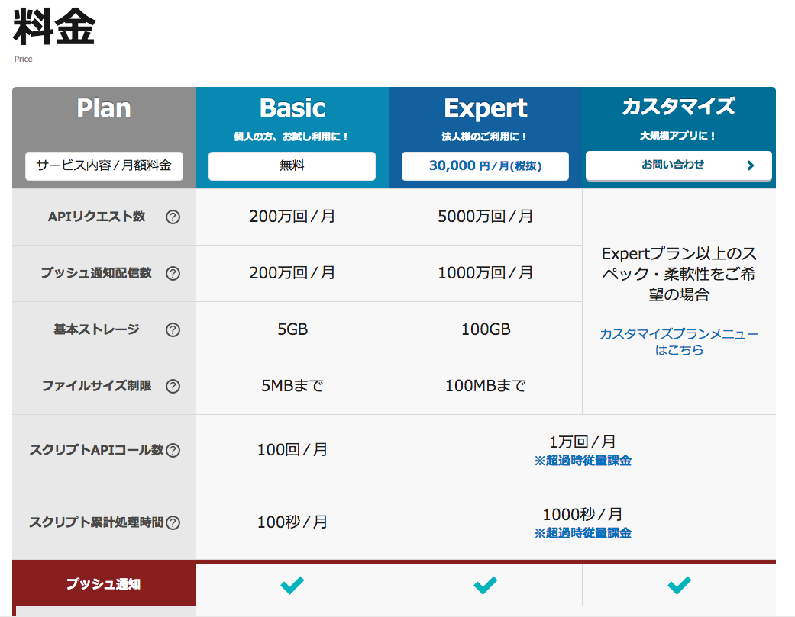

ニフティクラウド mobile backendの開発環境
----------

ニフティクラウド mobile backendは、ニフティ株式会社が提供しているmBaasです。
**mBaaSとは**、（mobile backend as a Service）の略で、スマートフォンアプリでよく利用される汎用的な機能をクラウドから提供するサービスです。

### ニフティクラウド mobile backendの機能

ニフティクラウド mobile backendが提供している機能としては以下があります。

* プッシュ通知
  - iOS/Android等の端末に対して、プッシュ通知を配信する機能
* 会員管理・認証
  - ログイン・ログアウト・権限管理・メールアドレス認証など、アプリ内の会員を管理する機能
* SNS連携
  - Twitter、Facebookのログイン認証機能を瞬時にアプリへ導入することが可能
* データストア
  - アプリで利用されるデータを保存・共有することができるデータベース機能
* ファイルストア
  - 画像やテキスト、音楽などさまざまな種類のファイルを保存することができるストレージ機能
* 位置情報検索
  - スマートフォンのGPS機能などを利用した位置情報を保存・管理する機能
* スクリプト
  - サーバーサイドにスクリプトを設置できる機能

引用: <http://mb.cloud.nifty.com/function.htm>

### ニフティクラウド mobile backendの料金プラン

ニフティクラウド mobile backendが提供している料金プランは以下です。
通常であれば無料枠内でアプリ開発をすることは可能です。

#### Basic(無料)プランの注意点

* Basicプランを利用している場合、お客様の本サービス最終ログイン時点および本サービス上にお客様が作成したアプリケーションへの最終アクセス時点から起算して1カ月が経過した時点において、該当アプリケーションは自動削除されます。
* Basicプランでは、サーバー負荷状況などに応じ、「基本ストレージ容量」、「APIリクエスト数」、「プッシュ通知数」、「スクリプトAPIコール数」、「スクリプト累計処理時間」は制限される場合がございます。

引用: <http://mb.cloud.nifty.com/price.htm>
