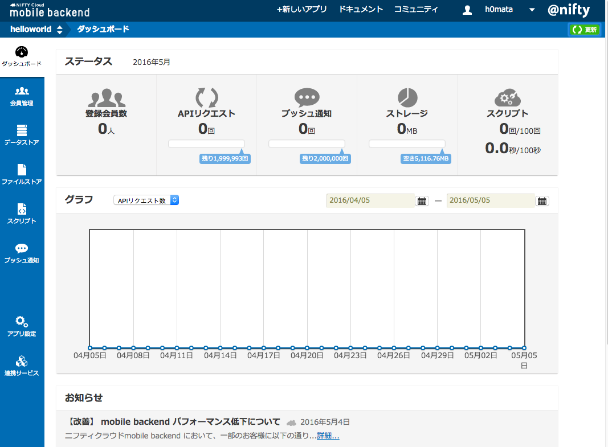
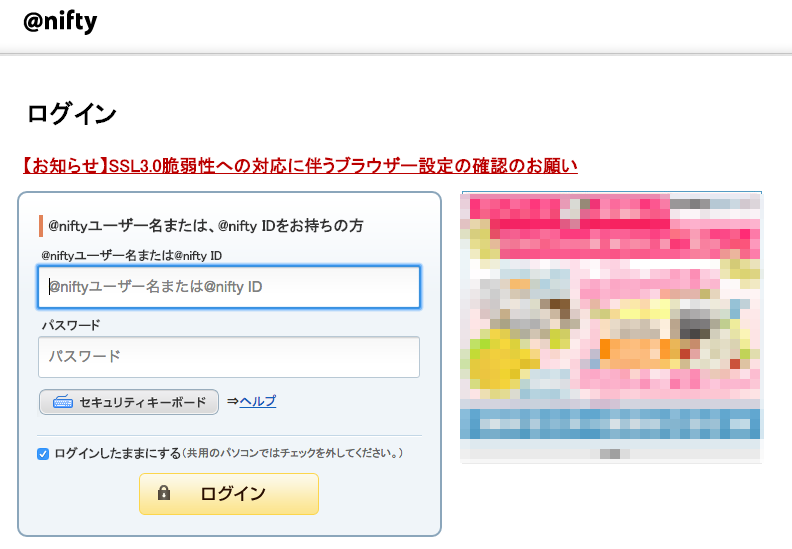
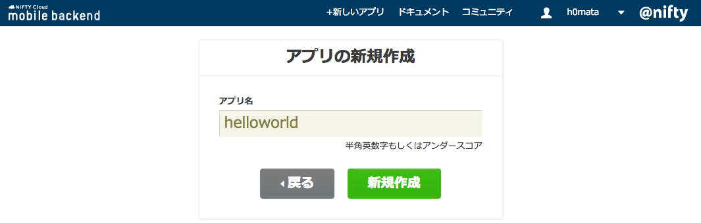
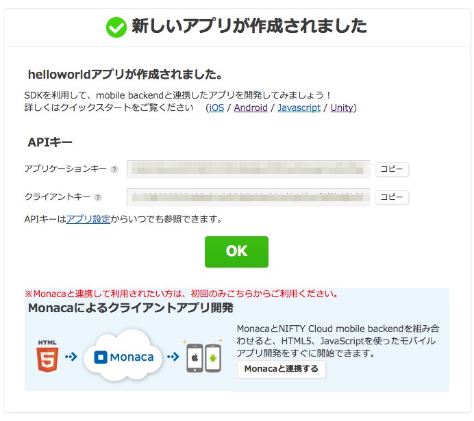
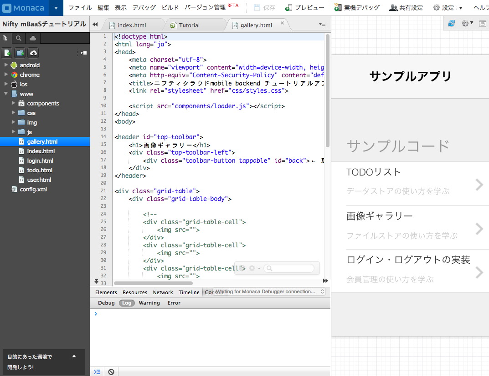

ニフティクラウド mobile backendのダッシュボード
----------

ニフティクラウド mobile backendのダッシュボードから、クラウド側の管理をします。

---

### ダッシュボードへの遷移

### ホームページ

ニフティクラウド mobile backendのホームページ(<http://mb.cloud.nifty.com/>)からログインをします。

---

### ログイン

@nifty IDとパスワードを入力してログインをします。

---

### アプリの新規作成

ニフティクラウド側のアプリを作成します。

---

### APIキー

端末アプリと連携する為のAPIキーが発行されます。このキーを使って端末側アプリと連携します。

---

### Monacaと連携する

APIキー画面で「Monacaと連携する」ボタンを押すと、Monaca側にで「Nift mBaaS チュートリアル」というサンプルアプリが作成されます。このサンプルはMonacaとニフティクラウドとの連携の為のサンプルアプりとなってます。

---

### ダッシュボード

ニフティクラウド側のダッシュボードです。このダッシュボードでニフティクラウド側の管理や利用状況がわかります。

## 参考

詳細な使い方は下記のドキュメントを参考にしてください。

* [開発者向けドキュメント](http://mb.cloud.nifty.com/doc/current/index.html)
