サンプルプロジェクト - Hello World
---------

Monaca クラウド IDEを使って、実際にプロジェクトを作ってみましょう。

---

## サンプルプロジェクト作成

---

### Monacaのホームページ

Monacaのホームページ (<https://ja.monaca.io/>)で、ログインのリンクをクリックします。

---

### ログイン

ログインのダイアログが表示されますので、ここに登録済みのメールアドレスとパスワードを入力してログインをします。
GitHub連携をされた方はGitHubアカウントでログインすることも可能です。

---

### ダッシュボード

Monacaのダッシュボード(<https://monaca.mobi/ja/dashboard>)から開発するプロジェクトを起動させます。
新規プロジェクトの作成する為に、「新規プロジェクトを作成」ボタンを選択します。

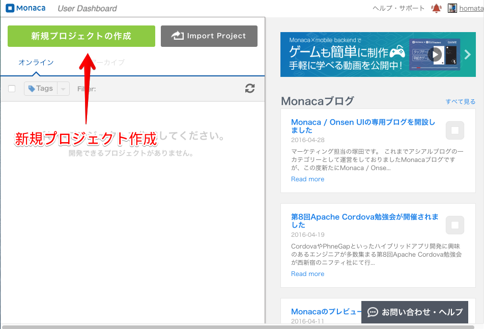

---

### HelloWorldアプリ作成

新規プロジェクトの「サンプルアプリ」のリンクをクリックします。
その後、HelloWorldの「作成」ボタンをクリックしてサンプルアプリのプロジェクトを作詞絵します。
「プレビュー」ボタンをクリックすると、サンプルアプリの動作イメージが表示されます。

**HelloWorld**とは、アプリやプログラミング言語を最初に試してみる例として
提供されるシンプルな構成のサンプルプログラムです。
ソフトウェアの世界ではよく使われるもので"HelloWorld"とはどういったものかを覚えておくと便利です。

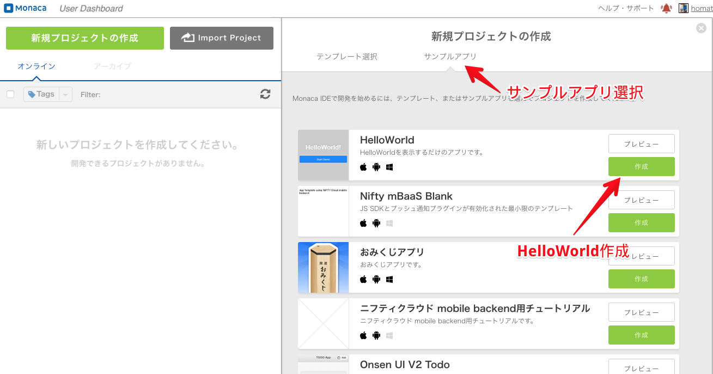

### 新規プロジェクト

新規プロジェクトの「プロジェクト名」と「説明」を入力します。
「プロジェクト名」には、プロジェクト名を入力してください。
「説明」はMonacaダッシュボードでプロジェクトの説明文を入力します。
入力しないで空でもプロジェクトを作成することは出来ます。

「プロジェクト作成」ボタンをクリックして、プロジェクトを実際に作成します。

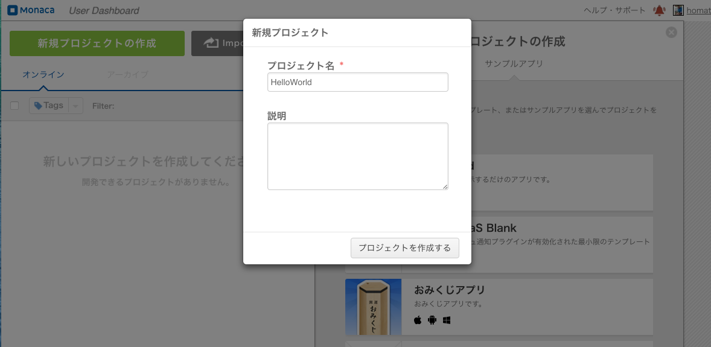

### プロジェクトを開く

作成したプロジェクトの「開く」ボタンをクリックして、プロジェクトを開きます。

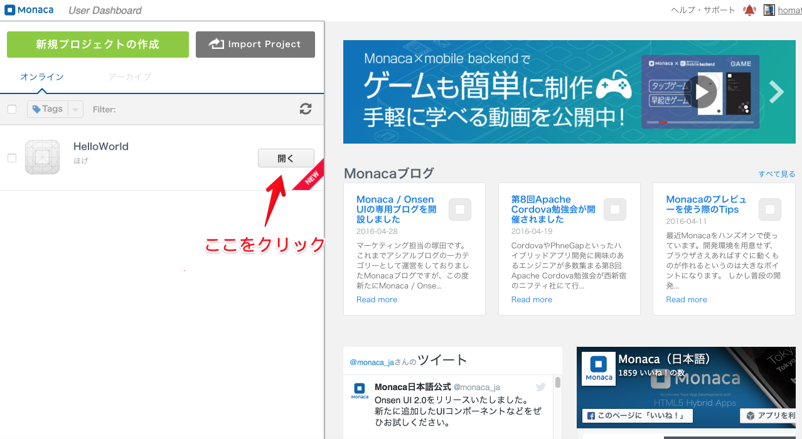

---

### メイン画面

Monaca クラウド IDEのメイン画面です。この画面上でコーディングやデバッグなどの開発作業をします。

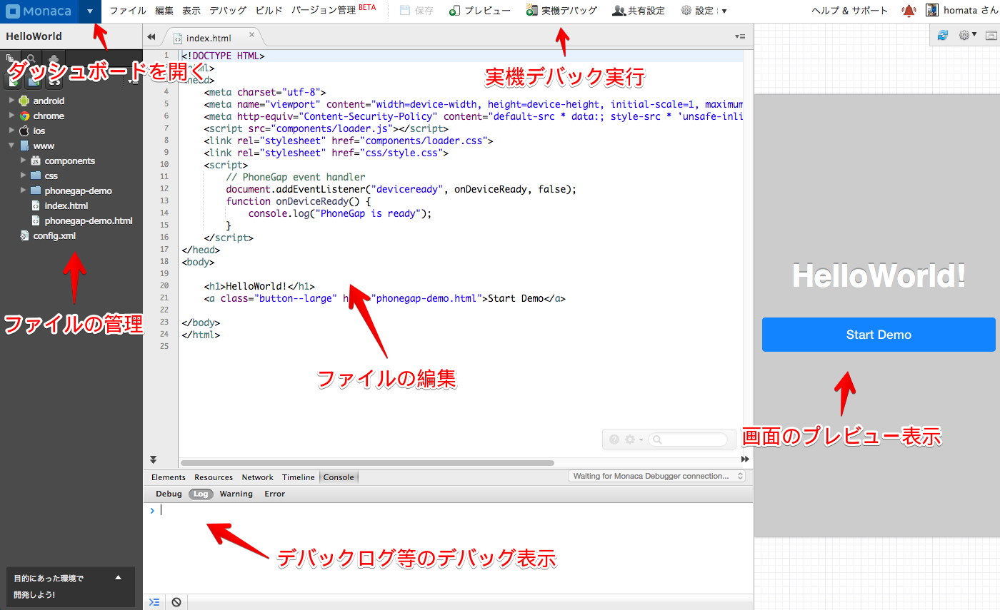

---

## デバッグ

### Monacaデバッカー アプリ起動

Android/iPhoneの端末にインストールした。Monacaデバックのアイコンをタップしてアプリを起動します。

  

---

### Monacaデバッカー

Monacaデバッカーを起動すると、下記のような画面が表示されます。
この画面から、デバッックするプロジェクトを選択してタップします。

  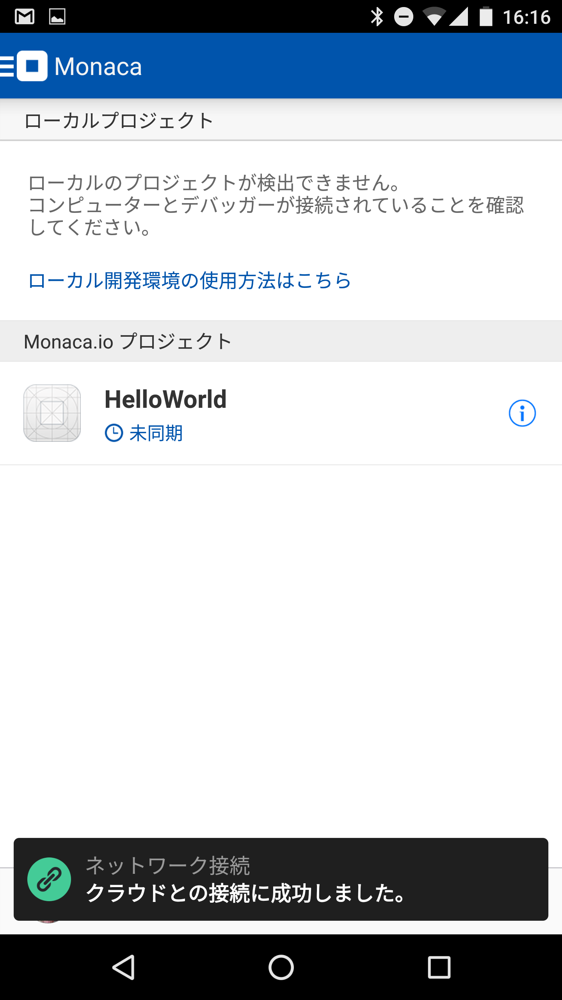

---

### HelloWorldアプリ 起動

HelloWorldアプリが起動されると作成したアプリの画面が表示されます。
この画面で作成したアプリの検証をしていきます。

  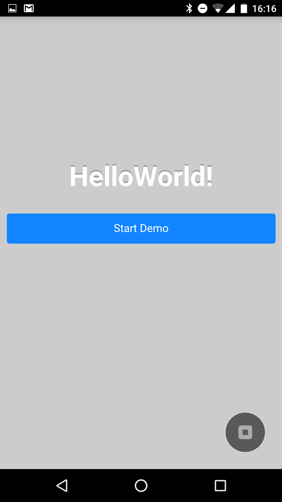

---

### デバッカー操作

右下のアイコンボタンをタップすると、デバッカの操作パネルになります。

  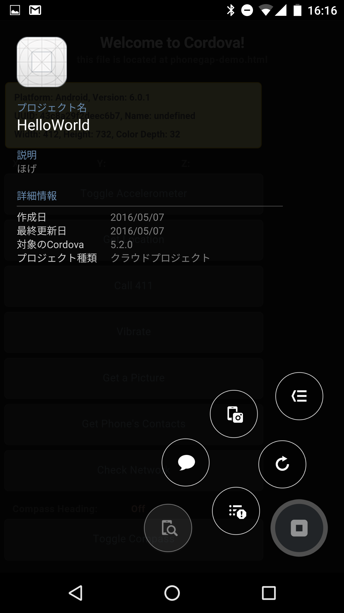

操作方法は下記です。

  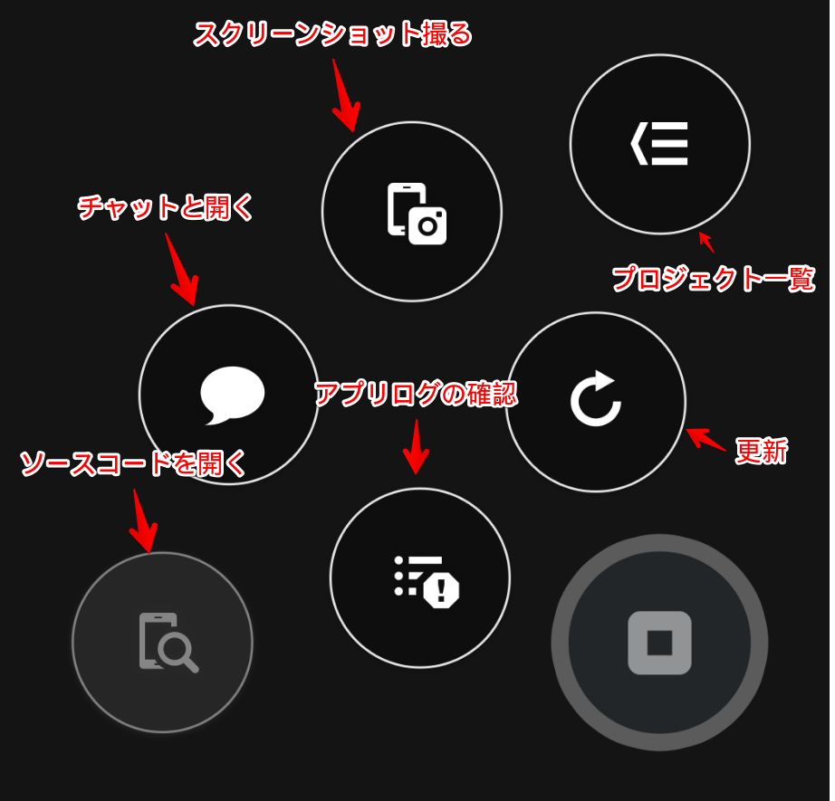

---

### Start Demo

アプリの「Start Demo」ボタンをタップすると、画面が切り替わりMonacaで対応している
機能を体験することが出来ます。

  

Monaca対応している機能の例

  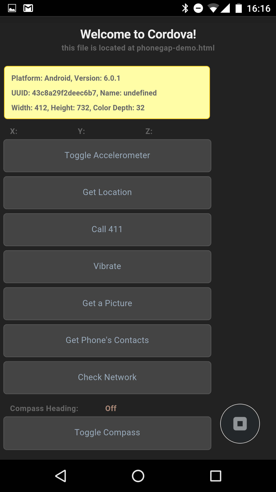

---

### クラウド側で「実機デバック」を起動する時の注意点

端末のMonacaデバッカーアプリより先に、クラウド側で「実機デバック」を起動した場合は
下記のようなエラーが出ます。この場合はアプリ側を起動した後に、
クラウド側の「再実行」ボタンを押してください。

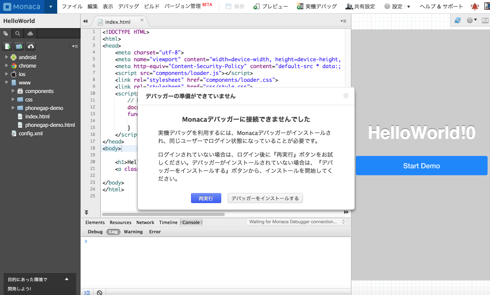

---

### ソースコードについて

* ソースコードはMonacaクラウドで保管されています。
* GitHub連携すれば、ソースコード管理をGitHubで行うことが出来ますにで変更履歴を保存することが出来ます

---

### Monacaドキュメント

Monacaに関する説明や資料は下記のリンクにありますので参考にしてみてください。

* Monacaドキュメント (<https://docs.monaca.io/ja/>)
  * 開発リファレンス(APIやプラグイン) (<https://docs.monaca.io/ja/reference/>)

