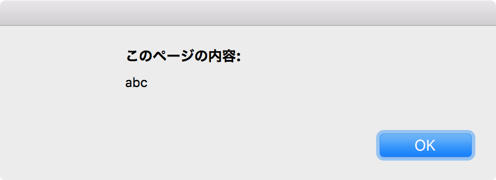
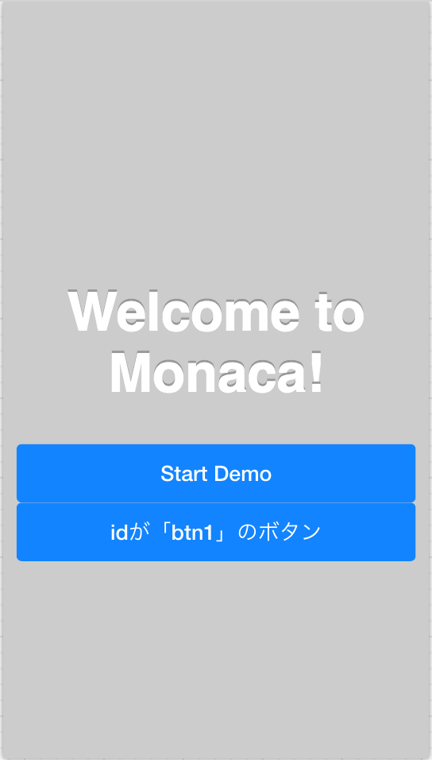

#JacaScript入門
##準備
JavaScriptとは、HTML上で動作するスクリプト言語です。  
HTMLに対して動的な処理を作成することができます。

JavaScriptには二つの記述方法があります。

1. HTMLファイルの`<script >`タグ内に記述する
2. 外部jsファイルとして記述する

今回は1で解説を進めます。  

まず[HTML入門](https://koriyamadojo.gitbooks.io/basic_course/content/intro_html.html)を参考にBlankプロジェクトを作成し、EMMETでHTMLの基本形を作成します。

このとき、`<head>`というタグが作成されます。  
タグの中で`script[type='text/javascript']`と打ってTabキーを押すと、JavaScriptを記述するためのタグが作成されます。
```html
<!doctype html>
<html lang="ja">
<head>
    <meta charset="UTF-8">
	<title>タイトル</title>
    <script type="text/javascript"></script> // 追加したタグ
</head>
<body>
	
</body>
</html>

```
これでHTMLファイル内にJavaScriptを記述する準備は完了です。  
以降は、この`<script>`タグの中にJavaScriptを記述していきます。

<br>
##関数とイベント
JavaScriptは、大きく分けて関数とイベントで記述されています。

###関数
関数とは、一度にまとめて行いたい処理を一つにまとめたものです。  
例えば、以下の処理は「abc」という名前の関数として記述されています。
```html
<script type="text/javascript">
    function abc() {  
        alert("abc");  
    }
</script>
```
関数abcは、実行すると画面上に以下のアラートを表示します。  


関数の特徴は、他の処理から呼び出されることによって動き始めることです。  
呼び出されない限り実行されることはありません。  
また、一度定義しておけば後で何度でも呼び出すことができます。

###イベント
イベントは、WEBブラウザ上で何らかのアクションが起こると発生します。

 - WEBブラウザそのものから発生するイベントの例
	 + HTMLの読込が完了した時
	 + ウィンドウのサイズを変更した時
 - ユーザーがアクションを起こしたタイミングで発生するイベントの例
	 + ボタンをクリックした時
	 + Enterキーを押した時

JavaScriptは、このようなイベントが発生したタイミングで処理を記述することができます。

<br>
####window.onloadイベントを作る
上記の例の中から、「HTMLの読込が完了した時」のイベント処理を記述してみます。  
```html
<script type="text/javascript">
    window.onload = function () {
        alert("abc");
    }
</script>
```
`window.onload`が「HTMLの読込が完了した時」というイベントを指定しています。  
この時に実行したい処理を`function() { }`の中に記述しています。

<br>
####ボタンクリックイベントを作る
上記の処理を「画面内のボタンがクリックされた時だけ実行する」という処理に書き換えてみます。

「Hello Worldアプリ」プロジェクトを新規作成すると、最初から画面内にボタンが作成されています。  
このボタンをコピーして、好きなIDを付けてボタンを作成しましょう。
```html
<a class="button--large" href="phonegap-demo.html">Start Demo</a>
<a class="button--large" id="btn1">#btn1</a>
```
このようになっていればOKです。  
  

次はJavaScriptです。

ボタンのクリックイベントは、HTMLの読込が完了した後に定義する必要があります。  
つまり`window.onload`の中で記述すれば良いのです。
```html
<script type="text/javascript">
    window.onload = function () {
        var eBtn1 = document.getElementById("btn1");	// ①
        eBtn1.addEventListener("click", function(){		// ②
            alert("abc");								// ③
        }
    }
</script>
```
[解説]

①対象となるボタンを指定  
　先程の例では「btn1」というIDを付けたので、IDを元に要素を取得しています。

②イベント定義  
　取得したボタンに対してaddEventListenerでクリックイベントを定義します。

③処理  
　イベント内で行う処理を記述します。

ここまで書けたら保存し、プレビューからボタンをクリックしてみてください。  
アラートが表示されたら成功です。

<br>