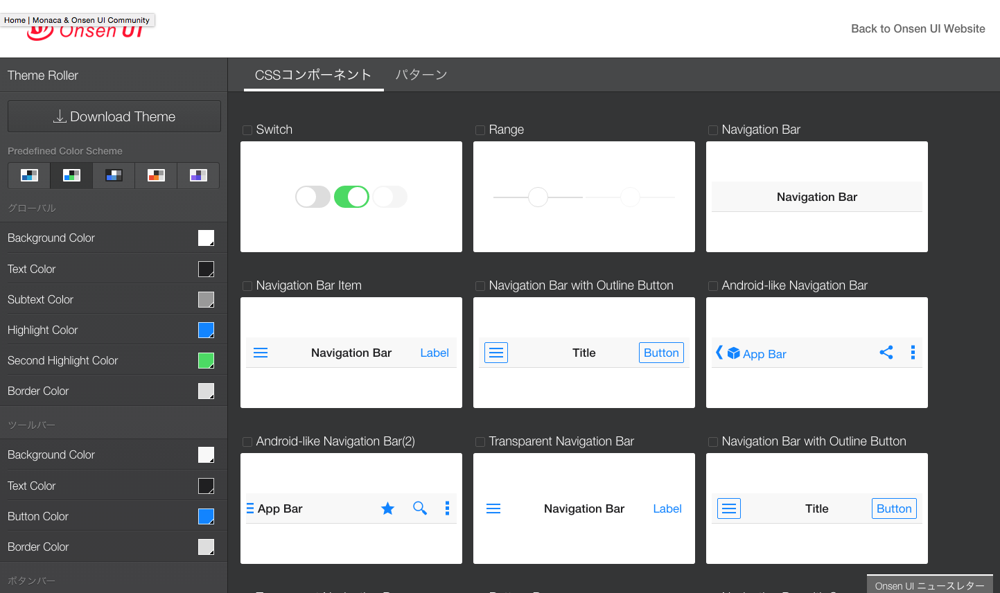

Onsen UI入門
----

[Onsen UI](https://ja.onsen.io/)はHTML5ベースのUI(User Interface)フレームワークです。

一般的にアプリ開発をする場合、アプリを一から開発することは殆どありません。

これは開発を一からするととても時間がかかり開発コストがかかるのと、
どんなアプリでもある程度はベース部分が同じようなコードとなるからです。

そこでアプリ開発ではフレームワークといったライブラリを使って、フレームワークの
雛形の上で開発をしていくことが殆どです。
有名なものとしては、Ruby on RailsのRailsやJavaScriptのnode.js等がフレームワークに
あたります。

HTML5であるHTML/CSS/JavaScriptでアプリ開発する場合も、いろんな種類のライブラリがありますが
今回はMonacaと相性のよいOnsen UIをご紹介します。

* [Onsen UIのサイト](https://ja.onsen.io/)

OnsenUIは、JavaScriptフレームワークの1つである、AngularJSをベースに作られています
UIという名前があるとおり、ボタン、テキストボックス、ツールバー、タブバー等といった画面
を構成するパーツが豊富です。このUIパーツを活用して、美しいUIをもったアプリを開発する
ことが可能なUIフレームワークです。

---

## Onsen UIのコード例

Onsen UIを使う場合は、独自のHTMLの拡張タグを記述して画面を作成していきます。
下記の例では、カメラアプリ等でよくあるタブ形式の画面を作成する例です。

ここにある**「ons」**という見慣れないタグがありますね。これがOnsen UIのタグでこの独自タグを記述して画面構成を作成して、作成した画面に対してJavaScriptや
CSS等でアプリを制御していきます。

---

## Onsen UIのショウケース

Onsen UIの[テーマローラのサイト](http://components.onsen.io/)では下記のような、
UIパーツやライブラリの例をみることが出来ます。

これはボタン等の例です

これは画面の例です

画面のソースコードはこんな風になってます。

---

## Onsen UIのドキュメント

* [リファレンスガイド](https://ja.onsen.io/v1/reference/javascript.html)
  - Onsen UIの仕様書です
* [チュートリアル](http://tutorial.onsen.io/)
  - Onsen UIをオンラインで学習とテストが出来るサイトです
* [テーマローラ](http://components.onsen.io/)
  - Onsen UIをコンポーネントの例です。

#### 困ったときは
* [stack overflow](https://ja.stackoverflow.com/questions/tagged/onsen-ui)
  - オンラインのQ&Aサイトです。困ったことがあれば相談をオンラインで行います。
* [開発者ブログ](https://ja.onsen.io/blog/) 
  - 開発者ブログではいろんな活用例が紹介されています。
* [フォーラム（英語）](https://community.onsen.io/)  
  - フォーラム形式のサイトもあります。英語ですが開発に関して議論をすることが出来ます

---

## Onsen UI 1.xガイド

Onsen UIはバージョン2がリリース候補として出ていますが、今回はバージョン1をベースに説明をします。
説明には、[Onsen UI 1.xガイド](https://ja.onsen.io/v1/guide.html)がよくまとまっているので
これをベースに説明をしていきます

* [Onsen UI 1.xガイド](https://ja.onsen.io/v1/guide.html)

---

