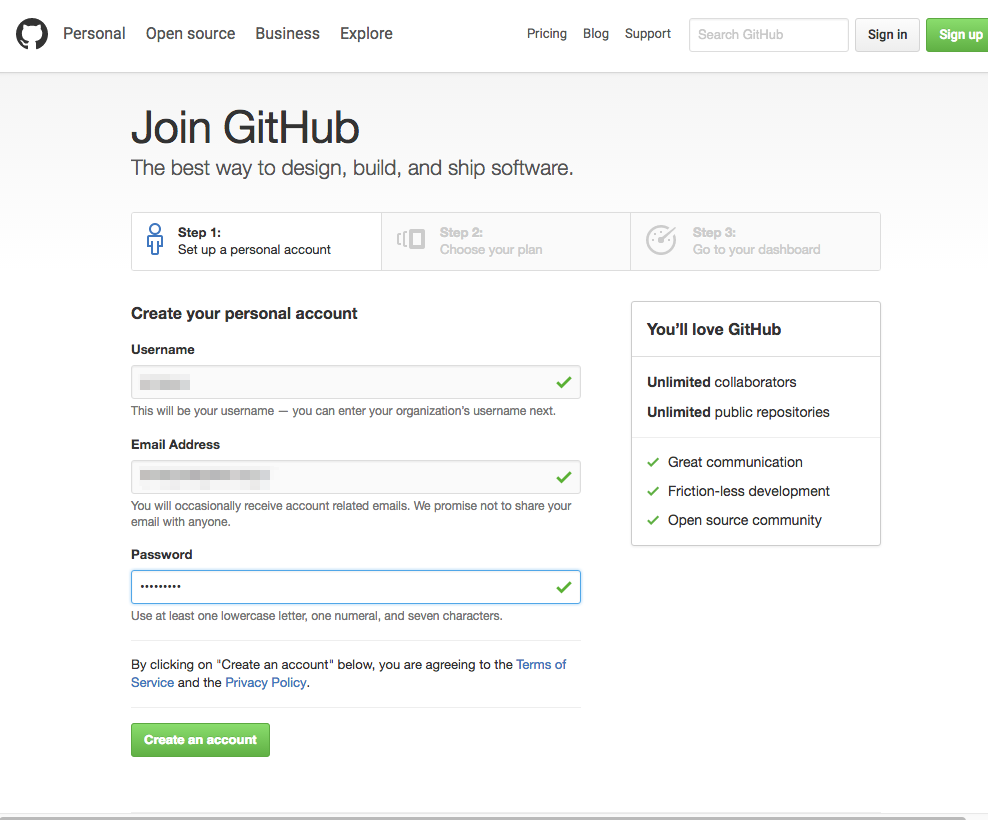
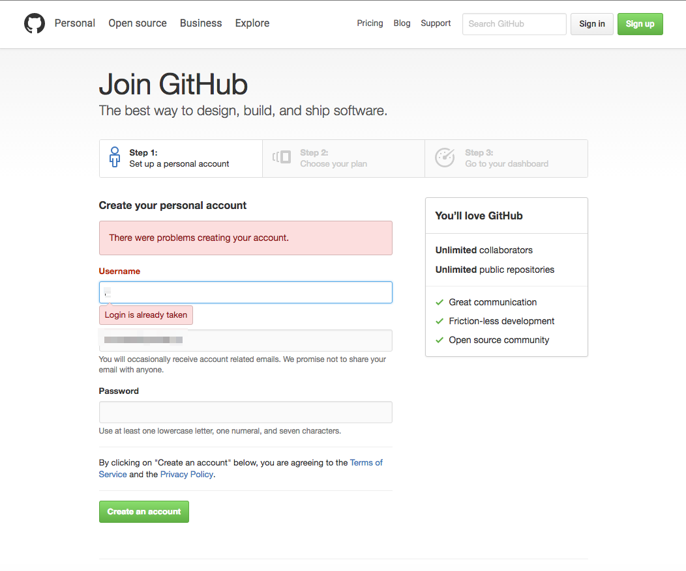
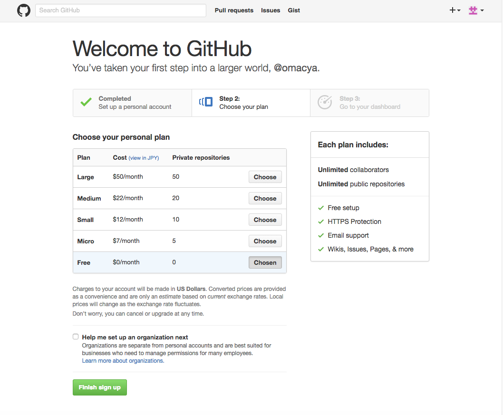

# GitHubのアカウント登録

GitHubのアカウント登録方法を説明します。

GitHubはソースコード管理やコードレビュー等に利用していく予定ですので、GitHubアカウントをお持ちでない方はアカウントの登録をお願いします。

---

#### 1. GitHubのホームページ

GitHubのホームページ (https://github.com/) の右上のSign upのリンクをクリックします。

##### GitHubのホームページから直接登録

GitHubのホームページから直接アカウントの登録をすることも出来ますが、今回は「右上のSign up」のリンクからの登録方法を説明します。

---

#### 2. GitHubのアカウント登録画面

GitHubの利用規約(Terms of Service)とプライバシーポリシー(Privacy Policy)は出来るだけ読んでください。
文章は英語なので大変ですが、Google翻訳などを利用すると少しは助けになるかとは思います。

GitHubアカウント登録に必要な入力項目は下記の3つとなります。

* Usename (ユーザー名)
 - 半角英数字
 - ユーザー名に日本語は使えません
* Email Address (Eメールアドレス)
* Password (パスワード)
 - 少なくとも1つの小文字、1つの数字と7文字以上の文字
 - パスワードに日本語は使えません

入力後「Create an account」ボタンを押してください。

##### GitHubアカウントのユーザー名の重複

GitHubアカウントのユーザー名が既に他の人に使用されている場合は、下記のような画面になります。
この場合は登録するユーザ名を変更してください。

---

#### 3. GitHubアカウントの料金プラン

GitHubは無料で利用することが出来るので、無料プランを選択してください。
「Finish sign up」をクリックすればGitHubアカウントの登録が完了となります。

