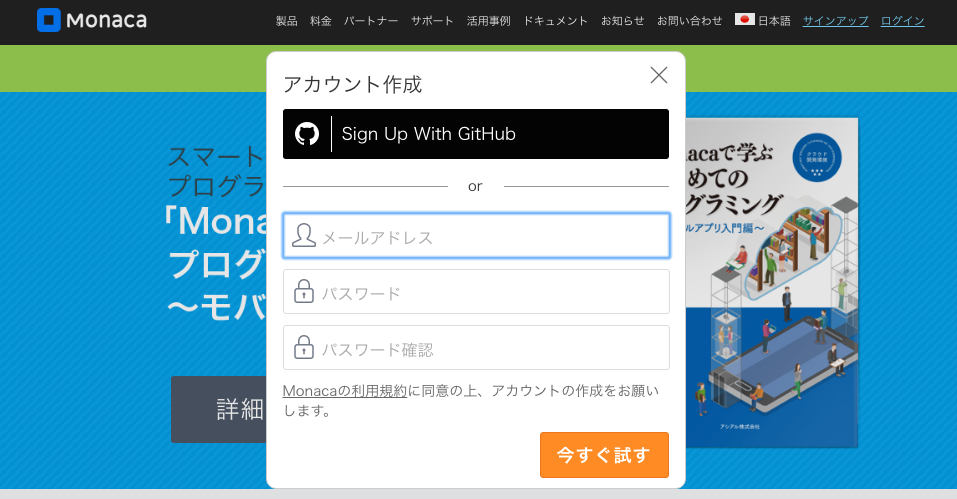
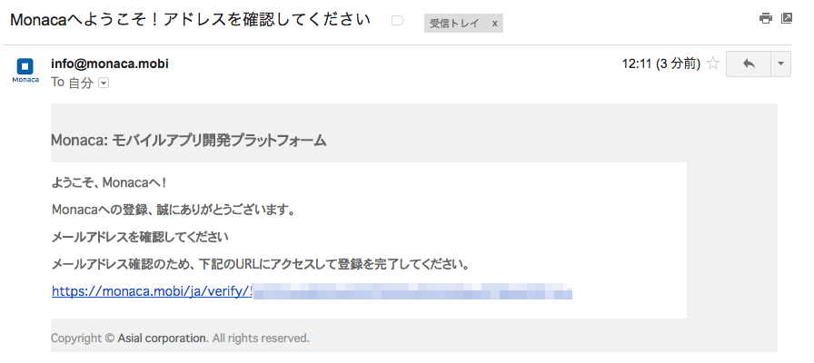

## Monacaのアカウント登録

Monacaのアカウント登録方法を説明します。

#### 1. Monacaのホームページ

Monacaのホームページ (<https://ja.monaca.io>) の右上のサインアップのリンクをクリックします。

#### 2. Monacaのアカウント登録画面

Monacaの利用規約を読んで同意した後に、メールアドレスとパスワードを入力します。
パスワードは同じものを２回入力してください。
入力後「今すぐ試す」ボタンを押してください。

※ GitHubアカウントを持っている方はGitHubアカウントでも登録することも可能です。

#### 3. 確認メール送信

登録したメールアドレスに登録の確認メールが送信されます。

#### 4. 登録完了

受信したメールの本文に記載されているリンクアドレスをクリックして登録を完了してください。
クリックをすることで登録が完了となります。

