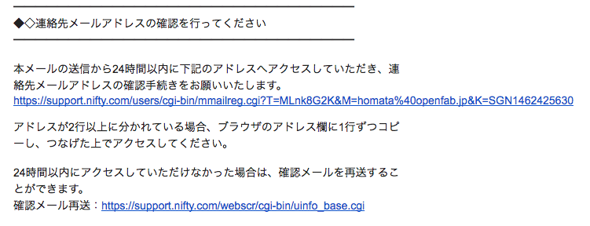

## ニフティクラウド mobile backendのアカウント登録

ニフティクラウド mobile backendのアカウント登録方法を説明します。

ニフティクラウド mobile backendのアカウントは、運営会社である
ニフティ株式会社(http://www.nifty.co.jp/) が運営する総合インターネット・サービスのアカウントである「@nifty ID」を取得する必要があります。

---

### A. @niftyアカウントの取得

ニフティクラウドmobile backendのホームページ (http://mb.cloud.nifty.com/) の右上の無料登録ボタンをクリックします。

#### A-1. @niftyアカウントのID登録を選択

個人会員の「@nifty会員の登録（無料）」をクリックします。

---

#### A-2. @niftyアカウントのID登録

登録する基本情報を入力します。

##### @niftyアカウントのユーザー名チェック

@nifty会員のユーザー名は、既に使われている名前は使用できませんので、登録されていない名前を登録する必要があります。「ユーザー名が使用できるか調べる」ボタンとクリックすると使用できるか確認することが出来ます。

##### @niftyアカウントのユーザー名が使われている

@niftyアカウントのユーザー名が既に他の人に使用されている場合は、下記のような画面になりますのでユーザ名を別なものに変更してください。

##### 基本情報入力完了

基本情報入力が全て完了したら、「登録」ボタンをクリックして@niftyアカウントのIDを登録します。

---

#### A-3. 登録内容の確認

入力した登録内容に間違いがないか、確認をして問題なければ「上記の内容で「登録する」」ボタンをクリックして登録をします。もし間違いがあれば「登録内容を「修正する」」ボタンをクリックして前に画面に戻って登録内容を修正します。

---

#### A-4. 登録完了と確認メール送信

登録が完了となります。登録したメールアドレスに確認メールが送信されるのでメールで確認する必要があります。

---

#### A-5. 確認メール受信

受信したメールの本文に記載されているリンクアドレスをクリックして登録確認をしてください。
クリックをすることで確認完了となります。

---

#### A-6. 登録確認完了

クリックをすると下記のような画面に遷移して登録確認が完了となります。

---

### B. ニフティクラウド mobile backendの登録

ニフティクラウドmobile backendのホームページ (http://mb.cloud.nifty.com/) の右上の無料登録ボタンをクリックします。

---

#### B-1. ニフティクラウド mobile backendのログイン

個人会員の「ニフティクラウドmobile backend」をクリックして、ログイン画面に遷移します。

#### B-2. ニフティクラウド mobile backendのログイン画面

登録した「@nifty」の アカウントとパスワードを入力してログインします。

---

#### B-3. ニフティクラウド mobile backendのアカウント登録

ニフティクラウド mobile backendの利用規約の確認し問題なければ、「以上の規約に同意する」のチェックボックス
をチェックしアカウント登録をします。

---

#### B-4. ニフティクラウド mobile backendのアカウント登録完了

アカウント登録が完了すると「アプリの新規作成」画面に遷移します。
ここではアカウント登録だけで終了となります。アプリの新規作成は別途説明します。

